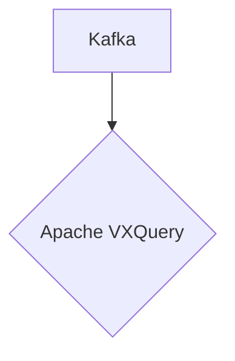

# Connect Kafka to Apache VXQuery

Quix helps you integrate Kafka to Apache VXQuery using pure Python.

## Apache VXQuery

Apache VXQuery is an advanced and powerful technology that is used for querying and analyzing data stored in XML format. It is an open-source implementation of the XQuery language, which is specifically designed for querying XML data sources. VXQuery is highly efficient and scalable, allowing users to easily query large volumes of XML data with high-performance results. It also provides users with a wide range of functions and features for data manipulation and analysis, making it a versatile tool for a variety of industries and applications. Additionally, Apache VXQuery is constantly being updated and improved by a community of developers, ensuring that users have access to the latest features and enhancements.

## Integrations

Apache VXQuery is an open-source technology that provides a powerful engine for querying and processing XML data. It allows users to write complex queries to extract, transform, and analyze data stored in XML format.

Quix would be a good fit for integrating with Apache VXQuery for several reasons:

1. Streamlined Development and Deployment: Quix Cloud offers integrated online code editors and CI/CD tools that simplify the creation and deployment of data pipelines. This would make it easy for developers to write and deploy VXQuery queries for processing XML data.

2. Real-Time Monitoring: Quix Cloud provides tools for real-time monitoring of pipeline performance and critical metrics. This would be beneficial for tracking the performance of VXQuery queries in real-time and ensuring they are running efficiently.

3. Flexible Scaling and Management: Quix Cloud allows for easy scaling of resources, CPU, and memory management. This capability would be useful for scaling Apache VXQuery queries to handle large volumes of XML data.

4. Security and Compliance: Quix Cloud ensures secure management of secrets and compliance with dedicated infrastructure options and SLAs. This would help in ensuring that the Apache VXQuery queries are executed in a secure and compliant manner.

5. Python Ecosystem Integration: Quix Streams, which is a cloud-native library for processing data in Kafka using Python, can easily integrate with Apache VXQuery. Both technologies operate in the Python ecosystem, making it seamless to work with them together.

Overall, the combination of Quix with Apache VXQuery would provide a comprehensive solution for querying and processing XML data in real-time, with streamlined development, monitoring, scaling, and security capabilities.

