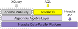
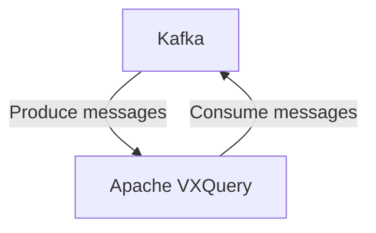

# Connect Kafka to Apache VXQuery

Quix helps you integrate Kafka to Apache VXQuery using pure Python.

<a class="md-button md-button--primary" href="https://share.hsforms.com/1iW0TmZzKQMChk0lxd_tGiw4yjw2?__hstc=175542013.2303933fbd746c0ac86d9ccbe9bc9100.1728383268831.1729603416735.1729620918855.31&__hssc=175542013.1.1729620918855&__hsfp=2132701734" target="_blank" style="margin-right:.5rem;">Book a demo</a>
 

## Apache VXQuery

Apache VXQuery is an open-source technology that provides a high-performance and scalable implementation of XQuery, a query and functional programming language that operates on XML data. VXQuery is designed to efficiently process complex and large-scale XML datasets, allowing users to query and manipulate the data with ease. The technology offers support for a wide range of XQuery features, including functions, types, and operations, making it a versatile tool for handling XML-based tasks. Additionally, Apache VXQuery comes with a robust query optimizer and execution engine, ensuring fast and efficient processing of queries. Overall, Apache VXQuery is a powerful solution for working with XML data in various applications and environments.

## Integrations

Quix is a good fit for integrating with Apache VXQuery because of its comprehensive platform designed for developing, deploying, and managing real-time data pipelines. 

1. Streamlined Development and Deployment: Quix offers integrated online code editors and CI/CD tools that simplify the creation and deployment of data pipelines. This aligns well with the capabilities of Apache VXQuery, which requires efficient development and deployment practices.

2. Enhanced Collaboration: Quix Cloud supports efficient collaboration with organization and permission management, which can enhance the teamwork required for integrating with Apache VXQuery.

3. Real-Time Monitoring: Quix Cloud provides tools for real-time logs, metrics, and data exploration, aligning with the need for real-time monitoring capabilities when working with Apache VXQuery.

4. Flexible Scaling and Management: Quix offers easy scaling of resources and management of CPU and memory, which can be beneficial when integrating with a technology like Apache VXQuery that may require additional resources.

5. Security and Compliance: Quix ensures secure management of secrets and compliance, which is crucial when working with sensitive data and complying with regulations.

6. Development Tools: Quix Cloud includes online code editors, code templates, and connectors for various data sources and sinks, supporting enhanced workflows that can streamline the integration process with Apache VXQuery.

7. Data Exploration and Visualization: Quix allows users to query, explore, and visualize data in real-time, which can be useful for analyzing the output of Apache VXQuery queries.

Overall, Quix's features and capabilities make it a good fit for integrating with Apache VXQuery, as it provides the necessary tools and infrastructure to streamline the development, deployment, and management of real-time data pipelines. Additionally, the compatibility with Kafka integration and Python ecosystem integration through Quix Streams can further enhance the integration process with Apache VXQuery.

