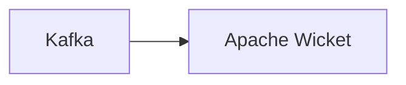

# Connect Kafka to Apache Wicket

Quix helps you integrate Kafka to Apache Wicket using pure Python.

## Apache Wicket

Apache Wicket is a Java web application framework that simplifies the development of complex web applications by allowing developers to focus on creating reusable components. With its component-based approach, developers can easily create dynamic and interactive web pages without having to worry about the underlying HTML and JavaScript code. Apache Wicket is built on the Model-View-Controller (MVC) architecture, making it easy to separate business logic from presentation. It also provides support for internationalization, validation, and session management, making it a versatile and powerful framework for building modern web applications. Overall, Apache Wicket offers a flexible and efficient solution for developing web applications, making it a popular choice among Java developers.

## Integrations

Quix is a great fit for integrating with Apache Wicket because of the following reasons:

1. Enhanced Collaboration: Quix Cloud provides efficient collaboration tools with organization and permission management, which increases visibility and control over projects. This aligns well with Apache Wicket, which emphasizes collaboration between developers and designers to build complex web applications.

2. Real-Time Monitoring: Quix Cloud offers tools for real-time monitoring of pipeline performance, logs, and metrics. This is crucial for Apache Wicket applications to ensure optimal performance and address any issues promptly.

3. Flexible Scaling and Management: Quix Cloud allows users to easily scale resources, manage CPU and memory, and handle multiple environments. This aligns with Apache Wicket's need for a flexible and scalable infrastructure to support dynamic web applications.

4. Development Tools: Quix Cloud provides online code editors, templates, and connectors for various data sources, which can enhance the development workflows for Apache Wicket applications.

5. Data Exploration and Visualization: Quix Cloud includes features for querying, exploring, and visualizing data in real-time. This can be beneficial for Apache Wicket applications that require efficient data processing and visualization capabilities.

6. Kafka Integration: Quix Cloud supports integration with Kafka, which is commonly used with Apache Wicket for real-time data streaming and processing.

Overall, the features and capabilities of Quix align well with the requirements of Apache Wicket applications, making it a suitable choice for integration with this technology.

