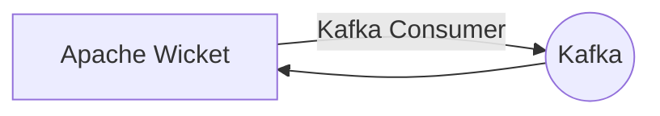

# Connect Kafka to Apache Wicket

Quix helps you integrate Kafka to Apache Wicket using pure Python.

<a class="md-button md-button--primary" href="https://share.hsforms.com/1iW0TmZzKQMChk0lxd_tGiw4yjw2?__hstc=175542013.2303933fbd746c0ac86d9ccbe9bc9100.1728383268831.1729603416735.1729620918855.31&__hssc=175542013.1.1729620918855&__hsfp=2132701734" target="_blank" style="margin-right:.5rem;">Book a demo</a>
 

## Apache Wicket

Apache Wicket is a web application framework for building complex, scalable, and maintainable applications in Java. It simplifies the development process by allowing developers to focus on writing clean, reusable code without the need for complex configuration or XML files. With its component-based programming model, developers can easily create dynamic web pages by combining pre-built components and adding custom behavior through Java code. Apache Wicket also offers support for AJAX functionality, making it easy to build interactive and responsive web applications. Overall, Apache Wicket provides a flexible and powerful platform for developers to create robust web applications with minimal effort.

## Integrations

Quix is a good fit for integrating with Apache Wicket because it offers a comprehensive platform for developing, deploying, and managing real-time data pipelines. Apache Wicket is a web application framework that focuses on simplicity, allowing developers to build complex web applications with minimal coding. By integrating Quix with Apache Wicket, developers can take advantage of the streamlined development and deployment features of Quix Cloud, such as integrated online code editors and CI/CD tools, to easily create and deploy data pipelines.

Furthermore, Quix Cloud's support for collaboration and organization management can enhance teamwork when working on Apache Wicket applications. The real-time monitoring capabilities of Quix Cloud can help developers monitor the performance of their Apache Wicket applications and make real-time adjustments as needed. Additionally, Quix Cloud's flexible scaling and management features allow users to easily scale resources and manage CPU and memory usage, which can be beneficial for Apache Wicket applications that may experience fluctuating demand.

Overall, integrating Quix with Apache Wicket can streamline the development and deployment process of web applications, enhance collaboration among team members, provide real-time monitoring and scaling capabilities, and ensure secure management of data and compliance with security best practices.

