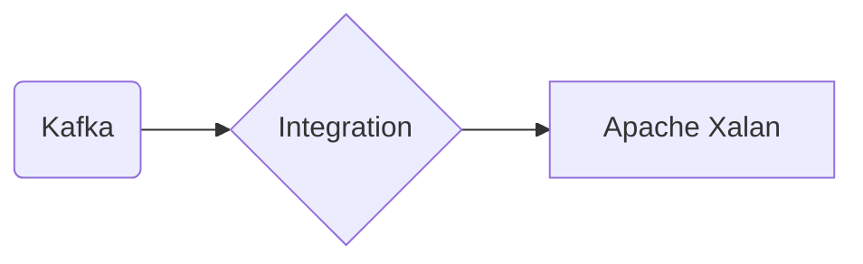

# Connect Kafka to Apache Xalan

Quix helps you integrate Kafka to Apache Xalan using pure Python.

## Apache Xalan

Apache Xalan is an open-source implementation of the XSLT (extensible Stylesheet Language Transformations) and XPath (XML Path Language) specifications. It is designed to transform XML files into various formats such as HTML, plain text, or other XML documents. Apache Xalan allows developers to create powerful and flexible transformations of XML data by applying stylesheets and rules defined in XSLT. It provides support for complex transformations, including sorting, grouping, and manipulating XML elements and attributes. Apache Xalan is widely used in web development and data processing applications to generate dynamic content and transform XML data for presentation and analysis.

## Integrations

Quix is a good fit for integrating with Apache Xalan because of its robust capabilities for developing, deploying, and managing real-time data pipelines. Apache Xalan, as a technology for transforming XML documents using XSLT, can benefit from the features and tools provided by Quix Cloud.

1. Streamlined Development and Deployment: Quix Cloud simplifies the creation and deployment of data pipelines, which can be beneficial for integrating with Apache Xalan and automating the transformation process.

2. Enhanced Collaboration: Efficient collaboration tools in Quix Cloud can enable teams working with Apache Xalan to better communicate, track changes, and manage the transformation processes effectively.

3. Real-Time Monitoring: With tools for real-time logs and monitoring in Quix Cloud, users can easily track the performance of the data pipelines and ensure the efficient transformation of XML documents by Apache Xalan.

4. Flexible Scaling and Management: Quix Cloud's ability to scale resources and manage environments can support Apache Xalan in handling varying workloads and scaling as needed.

5. Security and Compliance: Quix Cloud's secure management of secrets and compliance features can ensure that data transformations using Apache Xalan adhere to necessary security and regulatory standards.

By integrating Apache Xalan with Quix, developers can leverage the platform's features to enhance the efficiency, scalability, and security of their XML document transformation processes. This integration can streamline the development and deployment of data pipelines, improve collaboration among team members, provide real-time monitoring capabilities, and ensure compliance with security standards.

