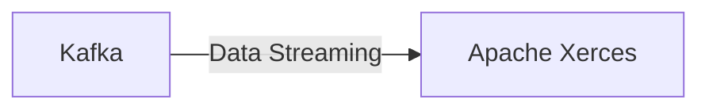

# Connect Kafka to Apache Xerces

Quix helps you integrate Kafka to Apache Xerces using pure Python.

Here is a simple Mermaid diagram for integrating Kafka with Apache Xerces:

## Apache Xerces

Apache Xerces is an open-source, standards-compliant XML parser and validator developed by the Apache Software Foundation. It provides support for the latest XML Schema Language specifications (XSD 1.1) and is capable of parsing and validating XML documents, ensuring they adhere to defined schema definitions. Apache Xerces also offers extensive error reporting and recovery mechanisms and supports advanced features such as validation with multiple schema files. It is widely used in various industries for processing and validating XML documents efficiently and accurately. With its robust and reliable capabilities, Apache Xerces is a go-to technology for developers working with XML data.

## Integrations

Quix is a good fit for integrating with Apache Xerces due to the comprehensive features they offer for developing, deploying, and managing real-time data pipelines. 

1. Streamlined Development and Deployment: With integrated online code editors, developers can easily work on integrating the Apache Xerces technology into their pipelines. The CI/CD tools provided by Quix Cloud allow for seamless deployment of the pipelines.

2. Enhanced Collaboration: The platform supports efficient collaboration, allowing team members to work together on integrating Apache Xerces into their pipelines. Organization and permission management features increase visibility and control over the project.

3. Real-Time Monitoring: Quix Cloud provides tools for real-time monitoring, which is essential for ensuring the successful integration of Apache Xerces. Monitoring performance and critical metrics in real-time helps in identifying any issues that may arise during the integration process.

4. Flexible Scaling and Management: The platform allows users to easily scale resources and manage CPU and memory requirements. This flexibility is beneficial for handling the integration of complex technologies like Apache Xerces.

5. Security and Compliance: With secure management of secrets and compliance features, Quix Cloud ensures that the integration process is conducted in a secure and compliant manner.

Overall, Quix Streams and Quix Cloud provide a robust and versatile platform for integrating technologies like Apache Xerces into real-time data pipelines, offering a seamless development and deployment experience with enhanced collaboration, monitoring, and scaling capabilities.

