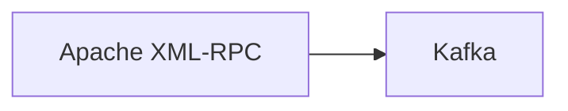

# Connect Kafka to Apache XML-RPC

Quix helps you integrate Kafka to Apache XML-RPC using pure Python.

## Apache XML-RPC

Apache XML-RPC is a versatile and powerful technology used for transmitting data between different systems over the internet. It provides a way for software programs to communicate with each other regardless of the programming language or platform they are built on. Using XML as the data format, Apache XML-RPC allows for easy serialization and deserialization of data, making it a reliable choice for web services and remote procedure calls. It also supports a wide range of data types and can be easily extended to include custom data structures. With its open-source nature and strong community support, Apache XML-RPC is a popular choice for building robust and scalable distributed systems.

## Integrations

Quix is a good fit for integrating with Apache XML-RPC technology because it offers a comprehensive platform for developing, deploying, and managing real-time data pipelines. This platform provides streamlined development and deployment processes, enhanced collaboration tools, real-time monitoring capabilities, flexible scaling and management options, security and compliance features, and robust CI/CD processes. 

With Quix Streams specifically, it offers cloud-native capabilities for processing data in Kafka using Python. This aligns well with the flexibility and ease of integration that Apache XML-RPC technology requires. Furthermore, Quix Streams supports various serialization formats, stateful operations, time window aggregations, and resilient scaling, making it a suitable choice for integrating with Apache XML-RPC for efficient data processing and communication. 

Overall, Quix's features and functionalities make it a strong candidate for integrating with Apache XML-RPC technology, enabling seamless data processing and communication in real-time applications.

