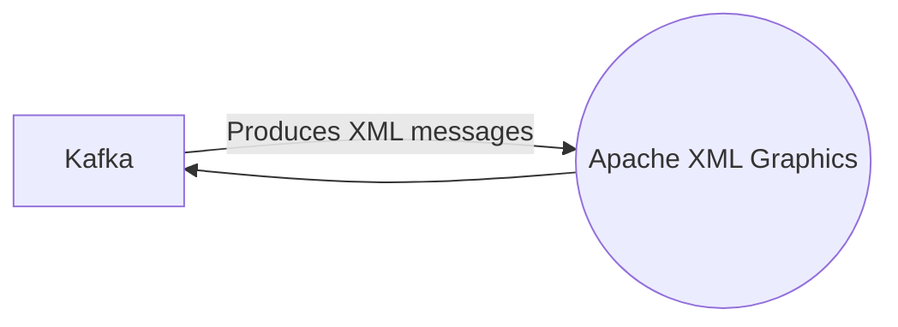

# Connect Kafka to Apache XML Graphics

Quix helps you integrate Kafka to Apache XML Graphics using pure Python.

## Apache XML Graphics

Apache XML Graphics is a powerful and versatile technology that allows for the creation and manipulation of scalable vector graphics in XML format. This technology enables developers to generate high-quality graphics that can be easily scaled and rendered on various devices and platforms. Apache XML Graphics includes a range of tools and libraries that support the creation of graphics for print, web, and mobile applications. With its open-source nature and extensive documentation, Apache XML Graphics is a popular choice for developers looking to create dynamic and visually appealing graphics.

## Integrations

Quix would be a good fit for integrating with Apache XML Graphics technology due to its flexibility, scalability, and real-time monitoring capabilities. 

1. Streamlined Development and Deployment: Quix Cloud's integrated online code editors and CI/CD tools simplify the creation and deployment of data pipelines, making it easier to integrate with Apache XML Graphics technology.

2. Real-Time Monitoring: Quix Cloud provides tools for real-time logs, metrics, and data exploration, allowing users to monitor pipeline performance and critical metrics, which is crucial for effectively integrating with Apache XML Graphics.

3. Flexible Scaling and Management: Quix Cloud allows users to easily scale resources and manage CPU and memory, making it easier to handle the processing requirements of Apache XML Graphics technology.

4. Enhanced Collaboration: The platform supports efficient collaboration with organization and permission management, which can facilitate the integration process with Apache XML Graphics by improving project visibility and control.

5. Security and Compliance: Quix Cloud ensures secure management of secrets and compliance, providing a secure environment for integrating with Apache XML Graphics technology.

Overall, Quix's features such as real-time monitoring, flexibility, scalability, and collaboration capabilities make it well-suited for integrating with Apache XML Graphics technology.

