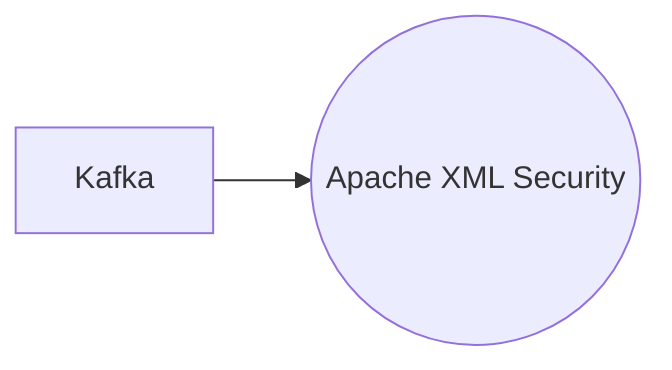

# Connect Kafka to Apache XML Security

Quix helps you integrate Kafka to Apache XML Security using pure Python.

## Apache XML Security

Apache XML Security is a technology that provides a comprehensive set of tools and libraries for securing and digitally signing XML documents. It offers a range of cryptographic functions, such as XML Encryption and XML Signature, to ensure the integrity, confidentiality, and authenticity of XML data. This technology allows developers to easily incorporate secure communication and data exchange features into their applications, ensuring that sensitive information remains protected. Apache XML Security is open-source, making it easily accessible and adaptable for a wide range of use cases and industries. With its robust security features and flexibility, Apache XML Security is a valuable tool for organizations looking to enhance the security of their XML-based applications and data exchanges.

## Integrations

Quix is a good fit for integrating with Apache XML Security because both platforms emphasize security and compliance as key components of their offerings. Quix Cloud ensures secure management of secrets and compliance with dedicated infrastructure options and SLAs, while Quix Streams operates without a server-side engine or orchestrator, enhancing security by reducing potential attack surfaces.

Additionally, Quix Cloud's support for DevContainers and integration with Git providers like GitHub and Bitbucket for seamless CI/CD processes align well with Apache XML Security's focus on secure development practices and version control. The real-time monitoring capabilities of Quix Cloud also complement the security features of Apache XML Security, allowing users to closely monitor pipeline performance and critical metrics for potential security issues.

Furthermore, Quix Streams' Python ecosystem integration and support for serialization and state management make it well-suited for processing and securing XML data using Apache XML Security. The platform's resilience scaling and time window aggregations capabilities ensure efficient and secure processing of data while maintaining compliance with security standards.

Overall, the combination of Quix with Apache XML Security provides a robust and secure solution for processing, securing, and managing data pipelines in real-time, making it a strong fit for organizations looking to prioritize data security and compliance within their technology stack.

