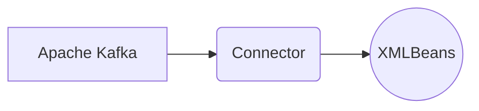

# Connect Kafka to Apache XMLBeans

Quix helps you integrate Kafka to Apache XMLBeans using pure Python.

## Apache XMLBeans

Apache XMLBeans is a technology developed by the Apache Software Foundation that allows for easy manipulation of XML data within Java applications. XMLBeans provides developers with a set of tools for accessing and modifying XML documents using a simple Java API. This technology provides a way to interact with XML data without having to deal with the complexities of parsing and processing XML directly. By using Apache XMLBeans, developers can easily read, write, and modify XML data within their Java applications, making it a valuable tool for handling XML data in a more efficient and intuitive way.

## Integrations

Apache XMLBeans is a technology for accessing and manipulating XML documents using Java objects. It provides a way to convert XML schema into Java classes, making it easier to work with XML data in Java applications. 

Integration of Quix with Apache XMLBeans would be beneficial for data processing pipelines that need to handle XML data. By utilizing the features and capabilities of Quix for developing, deploying, and managing real-time data pipelines, developers can streamline the integration of XML data processing into their applications.

Here are some reasons why Quix is a good fit for integrating with Apache XMLBeans:

1. Streamlined Development and Deployment: The integrated online code editors and CI/CD tools in Quix Cloud make it easy to develop and deploy data pipelines that involve processing XML data using Apache XMLBeans. This streamlines the development process and ensures quicker deployment of XML data processing pipelines.

2. Enhanced Collaboration: The collaboration features of Quix Cloud, such as organization and permission management, can enhance collaboration among team members working on integrating Apache XMLBeans into data pipelines. This ensures better project visibility and control over the integration process.

3. Real-Time Monitoring: Quix Cloud's real-time monitoring tools can be utilized to monitor the performance of data pipelines that involve processing XML data with Apache XMLBeans. This ensures that any issues or bottlenecks in the XML data processing are detected and addressed promptly.

4. Flexible Scaling and Management: With Quix Cloud, users can easily scale resources, manage CPU and memory, and handle multiple environments linked to Git branches, which is essential for handling the processing of large XML datasets using Apache XMLBeans.

5. Security and Compliance: Quix Cloud's secure management of secrets and compliance features ensure that data processed using Apache XMLBeans is handled securely and in compliance with regulations.

By integrating Quix with Apache XMLBeans, developers can leverage the strengths of both technologies to efficiently process XML data in real-time data pipelines. This integration can lead to more streamlined development processes, enhanced collaboration, real-time monitoring, and secure and compliant handling of XML data.

