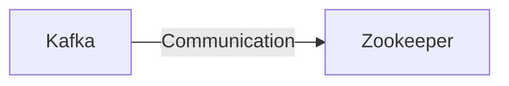

# Connect Kafka to Apache Zookeeper

Quix helps you integrate Kafka to Apache Zookeeper using pure Python.

<a class="md-button md-button--primary" href="https://share.hsforms.com/1iW0TmZzKQMChk0lxd_tGiw4yjw2?__hstc=175542013.2303933fbd746c0ac86d9ccbe9bc9100.1728383268831.1729603416735.1729620918855.31&__hssc=175542013.1.1729620918855&__hsfp=2132701734" target="_blank" style="margin-right:.5rem;">Book a demo</a>
 

## Apache Zookeeper

Apache Zookeeper is a centralized service for maintaining configuration information, naming, providing distributed synchronization, and group services. It is designed to be highly reliable and available, ensuring that distributed systems can operate smoothly and cohesively. Zookeeper provides a simple and consistent interface for managing the state of distributed systems, allowing developers to focus on building applications without worrying about the complexities of maintaining consistency and coordination across multiple nodes. With its robust set of features and easy-to-use API, Zookeeper is a valuable tool for ensuring the stability and scalability of modern distributed applications.

## Integrations

Apache Zookeeper is a centralized service for maintaining configuration information, providing distributed synchronization, and providing group services. It is commonly used for coordinating distributed systems, ensuring consistency and reliability in a distributed environment.

Quix, being a comprehensive platform for developing, deploying, and managing real-time data pipelines, would benefit greatly from integrating with Apache Zookeeper. Here's why Quix is a good fit for integrating with Apache Zookeeper:

1. Distributed Coordination: Apache Zookeeper is designed for coordinating distributed systems, ensuring that all nodes in a distributed system are in sync and maintaining consistency. This aligns well with the nature of real-time data pipelines, where multiple components need to work together in a distributed manner. Quix can leverage Zookeeper for managing resources, coordinating tasks, and maintaining state within the data pipeline.

2. Enhanced Reliability: By integrating with Apache Zookeeper, Quix can ensure increased reliability in managing distributed systems. Zookeeper provides fault-tolerant coordination and synchronization services, helping Quix to handle failures gracefully and maintain system integrity.

3. Scalability: Apache Zookeeper is scalable and can handle large numbers of nodes in a distributed environment. Quix, with its focus on real-time data processing and scaling capabilities, can benefit from Zookeeper's ability to scale seamlessly as the platform grows and additional resources are added.

4. Consistency and Atomicity: Zookeeper provides strong consistency guarantees and supports atomic operations, ensuring that distributed systems like Quix Cloud maintain data integrity and consistency. This is crucial for real-time data pipelines, where data accuracy and reliability are paramount.

5. Security: Apache Zookeeper offers robust security features, including authentication and access control mechanisms. By integrating with Zookeeper, Quix can enhance its security measures and ensure that sensitive data and configurations are protected within the platform.

Overall, integrating with Apache Zookeeper would enhance Quix's capabilities in managing real-time data pipelines, providing streamlined development, enhanced collaboration, and seamless scaling and management. The combination of Quix's comprehensive platform and Zookeeper's distributed coordination services would offer a reliable and scalable solution for organizations looking to build and manage complex data pipelines efficiently.

