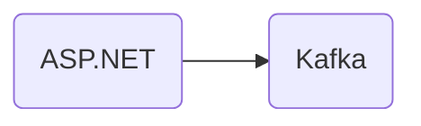

# Connect Kafka to ASP.NET

Quix helps you integrate Kafka to ASP.NET using pure Python.

## ASP.NET

ASP.NET is a web development framework created by Microsoft that allows developers to build dynamic, interactive websites and applications. It is based on the .NET framework and uses a combination of server-side controls and a scripting language called C# to create web pages. ASP.NET offers a wide range of features and tools that make it easy to create and maintain complex web applications, such as built-in security features, data access controls, and user authentication. It also provides support for various programming languages, databases, and web services, making it a versatile and flexible technology for building modern, responsive websites. Overall, ASP.NET is a powerful and widely-used platform for developing robust web applications with a user-friendly interface.

## Integrations

Quix would be a good fit for integrating with ASP.NET because of its powerful features that complement the capabilities of ASP.NET. 

Firstly, Quix Streams' cloud-native library for processing data in Kafka using Python would be advantageous for ASP.NET developers as it provides a user-friendly Python interface without the need for a server-side engine or orchestrator, making it easier to integrate with ASP.NET applications. Additionally, its support for serialization formats and state management using RocksDB can help in efficiently managing data within ASP.NET systems.

Furthermore, the scalability and resilience features of Quix Streams, such as container orchestration and time window aggregations, would benefit ASP.NET applications that require real-time data processing and analytics. The platform's support for local development and debugging through Jupyter Notebook can also enhance the development experience for ASP.NET developers.

In the case of Quix Cloud, its comprehensive platform for developing, deploying, and managing real-time data pipelines can provide ASP.NET developers with the tools needed to streamline development, enhance collaboration, and monitor pipeline performance effectively. The platform's integration with Git providers for CI/CD processes aligns well with ASP.NET development workflows, while its security and compliance features ensure that data handling is secure and compliant.

Overall, both Quix Streams and Quix Cloud offer features that can complement ASP.NET technology, making them a good fit for integrating with ASP.NET applications to enhance data processing, scalability, and monitoring capabilities.

