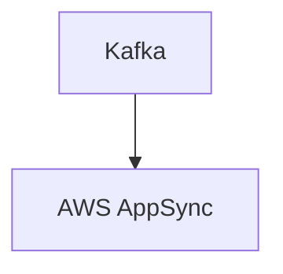

# Connect Kafka to AWS AppSync

Quix helps you integrate Kafka to AWS AppSync using pure Python.

<a class="md-button md-button--primary" href="https://share.hsforms.com/1iW0TmZzKQMChk0lxd_tGiw4yjw2?__hstc=175542013.2303933fbd746c0ac86d9ccbe9bc9100.1728383268831.1729603416735.1729620918855.31&__hssc=175542013.1.1729620918855&__hsfp=2132701734" target="_blank" style="margin-right:.5rem;">Book a demo</a>
 

## AWS AppSync

AWS AppSync is a fully managed service that allows developers to build scalable and secure real-time applications with ease. Using GraphQL, developers can quickly define the data requirements for their applications and AWS AppSync will automatically handle data fetching, updates, and synchronization. This technology enables developers to create interactive and responsive applications that can work offline and across multiple devices. With built-in support for features like offline data sync, real-time data updates, and automatic scaling, AWS AppSync simplifies the development process and empowers developers to build robust and efficient applications.

## Integrations

Quix is a good fit for integrating with AWS AppSync because it offers a comprehensive platform for developing, deploying, and managing real-time data pipelines. AWS AppSync is a managed GraphQL service that allows developers to easily connect their applications to various data sources and execute real-time data queries.

3Key reasons why Quix is a good fit for integrating with AWS AppSync:

1. Streamlined Development and Deployment: Quix Cloud offers integrated online code editors and CI/CD tools that simplify the creation and deployment of data pipelines. This aligns well with AWS AppSync's focus on simplifying data querying and manipulation.

2. Real-Time Monitoring: Quix Cloud provides tools for real-time logs, metrics, and data exploration, allowing users to monitor pipeline performance and critical metrics. This complements AWS AppSync's real-time capabilities, enabling developers to monitor and optimize their GraphQL queries in real time.

3. Flexible Scaling and Management: Quix Cloud allows users to easily scale resources, manage CPU and memory, and handle multiple environments linked to Git branches. This scalability and flexibility align well with AWS AppSync's ability to handle varying data loads and user demands.

Overall, the collaboration, real-time monitoring, and scaling capabilities offered by Quix make it a strong candidate for integrating with AWS AppSync, enhancing the development, deployment, and management of real-time data pipelines.

