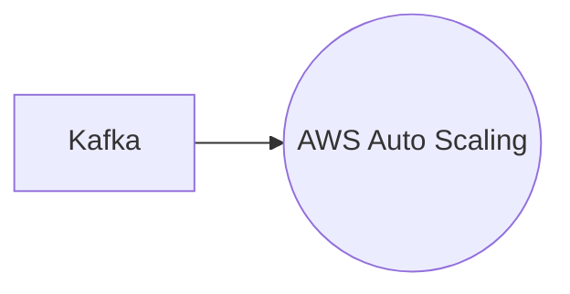

# Connect Kafka to AWS Auto Scaling

Quix helps you integrate Kafka to AWS Auto Scaling using pure Python.

<a class="md-button md-button--primary" href="https://share.hsforms.com/1iW0TmZzKQMChk0lxd_tGiw4yjw2?__hstc=175542013.2303933fbd746c0ac86d9ccbe9bc9100.1728383268831.1729603416735.1729620918855.31&__hssc=175542013.1.1729620918855&__hsfp=2132701734" target="_blank" style="margin-right:.5rem;">Book a demo</a>
 

## AWS Auto Scaling

AWS Auto Scaling is a technology provided by Amazon Web Services that allows users to automatically adjust the capacity of their resources to maintain optimal performance, while minimizing costs. By using metrics and thresholds set by the user, AWS Auto Scaling can add or remove instances based on demand, ensuring that applications can handle traffic fluctuations without manual intervention. This technology is ideal for applications with unpredictable workloads or for organizations looking to streamline resource management. With AWS Auto Scaling, users can easily scale their infrastructure up or down as needed, while maintaining high availability and efficiency.

## Integrations

Quix is a good fit for integrating with AWS Auto Scaling because it offers flexible scaling and management capabilities. With Quix, users can easily scale resources and manage CPU and memory to meet the demands of real-time data pipelines. This aligns well with AWS Auto Scaling, which automatically adjusts resources based on the workload to maintain performance and optimize costs.

Additionally, Quix's support for dedicated infrastructure options and SLAs ensures secure management of secrets and compliance, which is important when integrating with AWS services like Auto Scaling. The platform's robust CI/CD processes, Git integration, and synchronization via GitHub actions also make it easy to deploy and scale pipelines efficiently.

Furthermore, Quix Streams, a cloud-native library for processing data in Kafka using Python, complements the scalability of AWS Auto Scaling. The library's support for serialization formats, stateful operations, and time window aggregations aligns well with the requirements of real-time data processing, making it a valuable tool for integrating with AWS Auto Scaling.

Overall, Quix's comprehensive platform, flexible scaling capabilities, and support for Python ecosystem integration make it a suitable solution for integrating with AWS Auto Scaling to efficiently manage and scale real-time data pipelines.

