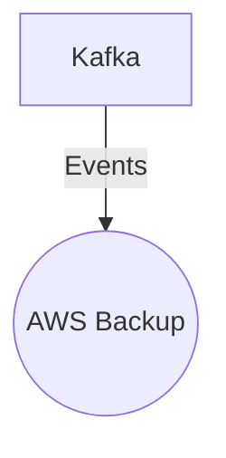

# Connect Kafka to AWS Backup

Quix helps you integrate Kafka to AWS Backup using pure Python.

- __Find out how we can help you integrate!__

    <a class="md-button md-button--primary" href="https://share.hsforms.com/1iW0TmZzKQMChk0lxd_tGiw4yjw2?__hstc=175542013.2303933fbd746c0ac86d9ccbe9bc9100.1728383268831.1729603416735.1729620918855.31&__hssc=175542013.1.1729620918855&__hsfp=2132701734" target="_blank" style="margin:.5rem;">Book a demo</a>

## AWS Backup

AWS Backup is a cloud-based service provided by Amazon Web Services that allows users to create and manage backups of their data and applications across multiple AWS services. With AWS Backup, users can easily schedule automated backups, set retention policies, and monitor the status of their backups through a centralized dashboard. This technology helps organizations ensure the security and availability of their data, as well as simplify the process of data protection and recovery. AWS Backup supports various AWS services such as Amazon EBS, Amazon RDS, and Amazon DynamoDB, making it a versatile solution for businesses of all sizes looking to streamline their backup and recovery processes.

## Integrations

Quix is a good fit for integrating with AWS Backup because of its comprehensive platform designed for developing, deploying, and managing real-time data pipelines. With its streamlined development and deployment capabilities, Quix makes it easy to create and deploy data pipelines, making it a seamless process to integrate with AWS Backup.

Additionally, Quix Cloud's real-time monitoring and scaling capabilities align well with the features of AWS Backup. The ability to monitor pipeline performance and critical metrics in real-time and easily scale resources aligns with the capabilities offered by AWS Backup to backup and restore data in real-time.

Furthermore, Quix Cloud's security and compliance features ensure secure management of data and compliance with regulations, which is crucial when integrating with backup solutions like AWS Backup. The platform's integration with Git providers for seamless CI/CD processes also enhances the efficiency of managing backups and restores.

Moreover, Quix Streams' ability to process data in Kafka using Python provides a seamless integration with AWS Backup, as AWS Backup supports various data sources and storage solutions. The Python ecosystem integration and support for time window aggregations make it easy to work with data in real-time and back up data efficiently.

Overall, Quix's features and capabilities make it a good fit for integrating with AWS Backup, providing a comprehensive solution for developing, deploying, and managing data pipelines and ensuring secure and efficient data backup and recovery processes.

