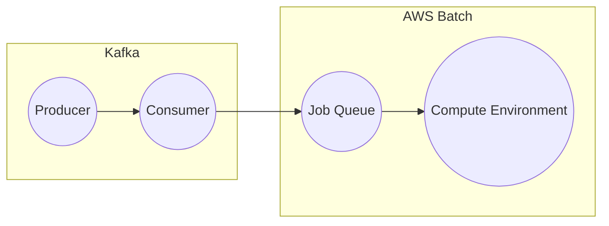

# Connect Kafka to AWS Batch

Quix helps you integrate Kafka to AWS Batch using pure Python.

<a class="md-button md-button--primary" href="https://share.hsforms.com/1iW0TmZzKQMChk0lxd_tGiw4yjw2?__hstc=175542013.2303933fbd746c0ac86d9ccbe9bc9100.1728383268831.1729603416735.1729620918855.31&__hssc=175542013.1.1729620918855&__hsfp=2132701734" target="_blank" style="margin-right:.5rem;">Book a demo</a>
 

## AWS Batch

AWS Batch is a cloud-based service provided by Amazon Web Services (AWS) that allows users to easily and efficiently run batch computing jobs in the cloud. With AWS Batch, users can dynamically provision the optimal quantity and type of computing resources needed to run their batch jobs, without needing to manage the underlying infrastructure. This technology enables users to prioritize and schedule their batch jobs, while also providing automatic scaling and workload balancing. AWS Batch is a cost-effective and scalable solution for running large-scale batch computing jobs, making it a valuable tool for businesses and organizations looking to streamline their batch processing workflows.

## Integrations

Quix is a good fit for integrating with AWS Batch because it offers a comprehensive platform for developing, deploying, and managing real-time data pipelines. 
1. Streamlined Development and Deployment: Quix's integrated online code editors and CI/CD tools make it easy to create and deploy data pipelines, which aligns well with the automation and scalability capabilities provided by AWS Batch.
2. Enhanced Collaboration: Quix's support for organization and permission management fosters efficient collaboration, which can be beneficial when multiple team members are working on AWS Batch pipelines.
3. Real-Time Monitoring: Quix Cloud's tools for real-time logs, metrics, and data exploration complement AWS Batch's monitoring capabilities, allowing users to monitor pipeline performance effectively.
4. Flexible Scaling and Management: Quix's ability to easily scale resources and manage CPU and memory aligns well with AWS Batch's elasticity and scalability features.
5. Security and Compliance: Quix's secure management of secrets and compliance measures can enhance the security of data pipelines integrated with AWS Batch.
6. Development Tools: Quix's online code editors, code templates, and connectors for various data sources and sinks can streamline development workflows when integrating with AWS Batch.
7. Data Exploration and Visualization: Quix's ability to query, explore, and visualize data in real-time can enhance the monitoring and analysis capabilities of data pipelines running on AWS Batch.
Overall, Quix's features complement the capabilities of AWS Batch, making it a suitable choice for integrating and managing real-time data pipelines.

