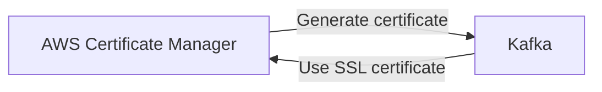

# Connect Kafka to AWS Certificate Manager

Quix helps you integrate Kafka to AWS Certificate Manager using pure Python.

- __Find out how we can help you integrate!__

    <a class="md-button md-button--primary" href="https://share.hsforms.com/1iW0TmZzKQMChk0lxd_tGiw4yjw2?__hstc=175542013.2303933fbd746c0ac86d9ccbe9bc9100.1728383268831.1729603416735.1729620918855.31&__hssc=175542013.1.1729620918855&__hsfp=2132701734" target="_blank" style="margin:.5rem;">Book a demo</a>

## AWS Certificate Manager

AWS Certificate Manager is a service provided by Amazon Web Services that allows users to easily provision, manage, and deploy SSL/TLS certificates for their websites or applications. With AWS Certificate Manager, users can quickly secure their applications without having to deal with the complex process of purchasing, uploading, and installing certificates. The service automatically handles the renewal and maintenance of certificates, ensuring that websites are always protected with up-to-date security measures. Additionally, AWS Certificate Manager integrates seamlessly with other AWS services, making it easy to secure applications running on Amazon cloud infrastructure.

## Integrations

Quix is a good fit for integrating with AWS Certificate Manager because it offers a comprehensive platform for developing, deploying, and managing real-time data pipelines. With its support for YAML synchronization and online code editors, Quix makes it easy to define pipelines and manage environment variables as code, which aligns well with the features provided by AWS Certificate Manager.

Additionally, Quix's focus on security and compliance ensures that sensitive data and secrets are managed securely, which is crucial when working with SSL/TLS certificates and managing encryption keys provided by AWS Certificate Manager. The platform's robust CI/CD processes and integration with Git providers also make it easy to automate the deployment and management of certificates across different environments.

Furthermore, Quix's support for Kafka integration, including options for running pipelines on dedicated infrastructure and visualizing logs and metrics through Grafana dashboards, enhances the scalability and monitoring capabilities when working with real-time data pipelines that use AWS Certificate Manager.

Overall, Quix's streamlined development and deployment processes, enhanced collaboration tools, and real-time monitoring capabilities make it a strong fit for integrating with AWS Certificate Manager to streamline the management of SSL/TLS certificates and ensure secure data transmission in real-time data pipelines.

