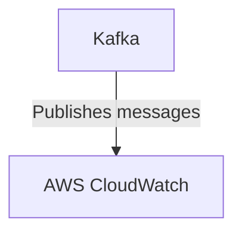

# Connect Kafka to AWS CloudWatch

Quix helps you integrate Kafka to AWS CloudWatch using pure Python.

- __Find out how we can help you integrate!__

    <a class="md-button md-button--primary" href="https://share.hsforms.com/1iW0TmZzKQMChk0lxd_tGiw4yjw2?__hstc=175542013.2303933fbd746c0ac86d9ccbe9bc9100.1728383268831.1729603416735.1729620918855.31&__hssc=175542013.1.1729620918855&__hsfp=2132701734" target="_blank" style="margin:.5rem;">Book a demo</a>

## AWS CloudWatch

AWS CloudWatch is a monitoring and management service provided by Amazon Web Services that allows users to collect and track metrics, monitor log files, set alarms, and automatically react to changes in their AWS resources. CloudWatch enables users to gain insights into the performance and health of their applications, infrastructure, and services. With CloudWatch, users can easily visualize their data through customizable dashboards, set up notifications for specific metrics, and automate actions based on predefined thresholds. This powerful technology helps organizations to optimize their resources, improve performance, and ensure the reliability and availability of their applications running on the AWS cloud.

## Integrations

Quix is a good fit for integrating with AWS CloudWatch because it offers real-time monitoring and scaling capabilities, which are essential features for effectively managing resources on the cloud. With Quix's robust monitoring tools for logs, metrics, and data exploration, users can easily track the performance of their data pipelines and make informed decisions about scaling resources in response to changing demands.

Additionally, Quix's integration with Kafka, including support for Quix-hosted and third-party Kafka solutions, aligns well with AWS CloudWatch's ability to monitor and track data streams and events in real-time. By leveraging the benefits of Quix Streams, users can effectively process data in Kafka using Python and seamlessly integrate with AWS CloudWatch for comprehensive monitoring and management of data pipelines.

Furthermore, Quix's flexible scaling and management capabilities, combined with its security and compliance features, make it a reliable choice for organizations looking to streamline the development, deployment, and monitoring of data pipelines on AWS CloudWatch. Overall, the combination of Quix's comprehensive platform and AWS CloudWatch's monitoring and management capabilities can enhance operational efficiency and ensure optimal performance of data pipelines in a cloud environment.

