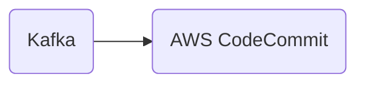

# Connect Kafka to AWS CodeCommit

Quix helps you integrate Kafka to AWS CodeCommit using pure Python.

<a class="md-button md-button--primary" href="https://share.hsforms.com/1iW0TmZzKQMChk0lxd_tGiw4yjw2?__hstc=175542013.2303933fbd746c0ac86d9ccbe9bc9100.1728383268831.1729603416735.1729620918855.31&__hssc=175542013.1.1729620918855&__hsfp=2132701734" target="_blank" style="margin-right:.5rem;">Book a demo</a>
 

## AWS CodeCommit

AWS CodeCommit is a fully-managed source control service provided by Amazon Web Services (AWS). It allows developers to securely store, manage, and track changes to their code repositories in the cloud. With CodeCommit, teams can collaborate on code projects, easily review and merge changes, and ensure that their code is always accessible and backed up. This technology supports Git, enabling developers to use familiar tools and workflows to work on their codebase. CodeCommit also integrates seamlessly with other AWS services, such as AWS CodeBuild and AWS CodePipeline, to automate the build, test, and deployment processes. Overall, AWS CodeCommit provides a reliable and scalable solution for version control that helps teams streamline their development workflows and deliver high-quality code faster.

## Integrations

Quix is a good fit for integrating with AWS CodeCommit because it offers a comprehensive platform for developing, deploying, and managing data pipelines. The platform's streamlined development and deployment capabilities, enhanced collaboration tools, and real-time monitoring and scaling capabilities make it a natural fit for AWS CodeCommit.

Quix's integrated online code editors and CI/CD tools simplify the creation and deployment of data pipelines, which can easily integrate with AWS CodeCommit for version control and code collaboration. The platform's support for organization and permission management enhances collaboration among team members, which aligns well with the features offered by AWS CodeCommit for managing access controls and permissions.

Additionally, Quix Cloud's tools for real-time monitoring and scaling, as well as its robust CI/CD processes, complement the capabilities of AWS CodeCommit for continuous integration and deployment. The platform's support for secure management of secrets and compliance with dedicated infrastructure options further enhances security and compliance measures when integrating with AWS CodeCommit.

Furthermore, Quix Streams, a cloud-native library for processing data in Kafka using Python, offers additional benefits such as seamless integration with the Python ecosystem, support for serialization formats, time window aggregations, and resilient scaling through container orchestration. These features align well with the capabilities of AWS CodeCommit for managing code repositories and facilitating collaboration among developers working on data pipelines.

Overall, Quix's comprehensive platform, combined with its support for real-time data processing and Python-based libraries like Quix Streams, makes it a strong candidate for integrating with AWS CodeCommit for efficient and streamlined development, deployment, and management of data pipelines.

