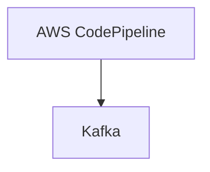

# Connect Kafka to AWS CodePipeline

Quix helps you integrate Kafka to AWS CodePipeline using pure Python.

<a class="md-button md-button--primary" href="https://share.hsforms.com/1iW0TmZzKQMChk0lxd_tGiw4yjw2?__hstc=175542013.2303933fbd746c0ac86d9ccbe9bc9100.1728383268831.1729603416735.1729620918855.31&__hssc=175542013.1.1729620918855&__hsfp=2132701734" target="_blank" style="margin-right:.5rem;">Book a demo</a>
 

## AWS CodePipeline

AWS CodePipeline is a continuous integration and continuous delivery service provided by Amazon Web Services. It automates the process of releasing software updates from code changes in a consistent and efficient manner. With CodePipeline, developers can easily define the workflow of their release process, including the source repository, build and test stages, and deployment targets. It supports a wide range of popular tools and frameworks, making it easy to integrate with existing development workflows. CodePipeline also provides real-time monitoring and notifications, allowing teams to track the progress of their deployments and quickly address any issues that may arise. Overall, AWS CodePipeline simplifies the release process and helps teams deliver high-quality software updates with speed and reliability.

## Integrations

Quix is a good fit for integrating with AWS CodePipeline because it provides a comprehensive platform for developing, deploying, and managing real-time data pipelines. Here are a few reasons why Quix is a good fit for integrating with AWS CodePipeline:

1. Streamlined Development and Deployment: Quix offers integrated online code editors and CI/CD tools that simplify the creation and deployment of data pipelines. This aligns well with AWS CodePipeline, which automates the build, test, and deployment phases of your release process.

2. Enhanced Collaboration: Quix Cloud supports efficient collaboration with organization and permission management, increasing project visibility and control. This aligns well with AWS CodePipeline, which allows for collaboration and approval processes in your deployment pipelines.

3. Real-Time Monitoring: Quix Cloud provides tools for real-time logs, metrics, and data exploration, allowing users to monitor pipeline performance and critical metrics. This real-time monitoring capability complements AWS CodePipeline's visibility into the status of your pipeline at every stage.

4. Flexible Scaling and Management: Quix Cloud allows users to easily scale resources, manage CPU and memory, and handle multiple environments linked to Git branches. This flexibility aligns well with AWS CodePipeline, which allows for scaling pipelines to meet your needs.

5. Security and Compliance: Quix Cloud ensures secure management of secrets and compliance with dedicated infrastructure options and SLAs. This focus on security and compliance aligns well with AWS CodePipeline's secure and controlled deployment processes.

Overall, Quix's comprehensive platform for developing and managing real-time data pipelines complements the automation and collaboration features provided by AWS CodePipeline, making it a good fit for integration with this technology.

