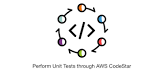

# Connect Kafka to AWS CodeStar

Quix helps you integrate Kafka to AWS CodeStar using pure Python.

<a class="md-button md-button--primary" href="https://share.hsforms.com/1iW0TmZzKQMChk0lxd_tGiw4yjw2?__hstc=175542013.2303933fbd746c0ac86d9ccbe9bc9100.1728383268831.1729603416735.1729620918855.31&__hssc=175542013.1.1729620918855&__hsfp=2132701734" target="_blank" style="margin-right:.5rem;">Book a demo</a>
 

## AWS CodeStar

AWS CodeStar is a cloud-based development tool provided by Amazon Web Services that helps developers quickly set up and manage their software projects. By integrating various AWS services such as CodeCommit, CodeBuild, and CodePipeline, CodeStar streamlines the process of building, testing, and deploying applications. With a user-friendly interface and project templates, developers can easily collaborate with team members, track progress, and monitor performance. CodeStar also offers built-in project monitoring and automated code reviews to ensure code quality and security. Overall, AWS CodeStar simplifies the development process and enables teams to deliver high-quality software faster.

## Integrations

Quix is a good fit for integrating with AWS CodeStar because it offers a comprehensive platform for developing, deploying, and managing real-time data pipelines, which aligns well with the capabilities of AWS CodeStar. Here are a few reasons why Quix is a good fit for integrating with AWS CodeStar:

1. Streamlined Development and Deployment: Quix provides integrated online code editors and CI/CD tools that simplify the creation and deployment of data pipelines. This aligns well with AWS CodeStar's focus on streamlining development and deployment processes.

2. Enhanced Collaboration: Quix supports efficient collaboration through organization and permission management, increasing project visibility and control. This can help teams working with AWS CodeStar to collaborate more effectively on their projects.

3. Real-Time Monitoring: Quix Cloud offers tools for real-time logs, metrics, and data exploration, allowing users to monitor pipeline performance and critical metrics. This can enhance the monitoring capabilities of projects managed with AWS CodeStar.

4. Flexible Scaling and Management: Quix allows users to easily scale resources, manage CPU and memory, and handle multiple environments linked to Git branches. This can complement the scaling and management features provided by AWS CodeStar.

5. Security and Compliance: Quix ensures secure management of secrets and compliance with dedicated infrastructure options and SLAs, which is crucial for projects hosted on AWS CodeStar to adhere to security and compliance standards.

In addition, Quix Streams, a cloud-native library for processing data in Kafka using Python, can also integrate well with AWS CodeStar, especially if the project requires processing data from Kafka streams. With benefits such as no JVM requirement, Python ecosystem integration, serialization and state management support, time window aggregations, and resilience scaling, Quix Streams can enhance the capabilities of projects developed and managed through AWS CodeStar. 

Overall, with its focus on streamlined development, enhanced collaboration, real-time monitoring, flexible scaling, and security features, Quix is a good fit for integrating with AWS CodeStar to enhance the development and management of real-time data pipelines.

