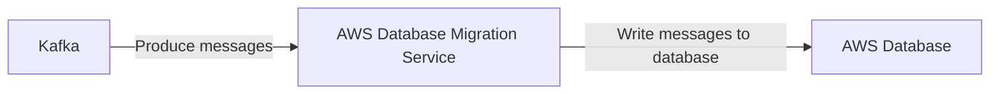

# Connect Kafka to AWS Database Migration Service

Quix helps you integrate Kafka to AWS Database Migration Service using pure Python.

- __Find out how we can help you integrate!__

    <a class="md-button md-button--primary" href="https://share.hsforms.com/1iW0TmZzKQMChk0lxd_tGiw4yjw2?__hstc=175542013.2303933fbd746c0ac86d9ccbe9bc9100.1728383268831.1729603416735.1729620918855.31&__hssc=175542013.1.1729620918855&__hsfp=2132701734" target="_blank" style="margin:.5rem;">Book a demo</a>

## AWS Database Migration Service

AWS Database Migration Service is a technology that allows users to easily and securely migrate their databases to AWS cloud. It supports both homogenous and heterogeneous migrations, meaning users can migrate their databases from one database engine to another. With AWS Database Migration Service, users can minimize downtime during the migration process, maintain data consistency, and replicate ongoing changes from the source database to the target database. This technology simplifies the migration process by handling all the complexities involved in database migration, such as schema conversion, data transfer, and maintaining data integrity. AWS Database Migration Service provides a seamless and efficient way for users to migrate their databases to AWS cloud without worrying about data loss or disruption to their applications.

## Integrations

Quix is a good fit for integrating with AWS Database Migration Service because of its comprehensive platform designed for developing, deploying, and managing real-time data pipelines. AWS Database Migration Service facilitates the migration of databases to and from the AWS cloud, making it easier for organizations to manage and process their data.

Quix's Streamlined Development and Deployment feature, which includes online code editors and CI/CD tools, can streamline the creation and deployment of data pipelines, making it easier to migrate databases using AWS Database Migration Service. The ability to define pipelines and environment variables as code with YAML synchronization also enhances the development process.

Enhanced Collaboration in Quix allows for efficient project collaboration, which can be beneficial when integrating with AWS Database Migration Service to ensure a smooth migration process. Real-Time Monitoring tools in Quix Cloud can help track pipeline performance and critical metrics during the database migration.

Quix's Flexible Scaling and Management feature allows users to easily scale resources, manage CPU and memory, and handle multiple environments linked to Git branches, providing flexibility and control in integrating with AWS Database Migration Service. Additionally, the platform's focus on Security and Compliance ensures that sensitive data is securely managed during the migration process.

Furthermore, Quix's integration with Git providers like GitHub and Bitbucket for robust CI/CD processes can facilitate seamless migration of databases using AWS Database Migration Service. The platform's support for third-party Kafka solutions, including Confluent Cloud and Redpanda, can also be beneficial in integrating with AWS Database Migration Service.

Overall, Quix's features, such as its development tools, data exploration capabilities, Kafka integration, and dedicated infrastructure options, make it a suitable candidate for integrating with AWS Database Migration Service for efficient and streamlined database migration processes.

