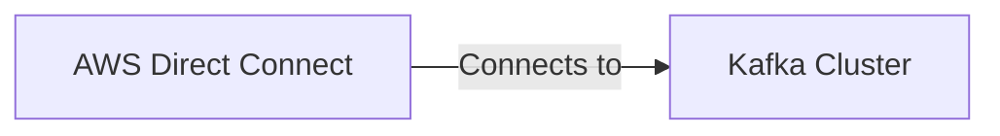

# Connect Kafka to AWS Direct Connect

Quix helps you integrate Kafka to AWS Direct Connect using pure Python.

<a class="md-button md-button--primary" href="https://share.hsforms.com/1iW0TmZzKQMChk0lxd_tGiw4yjw2?__hstc=175542013.2303933fbd746c0ac86d9ccbe9bc9100.1728383268831.1729603416735.1729620918855.31&__hssc=175542013.1.1729620918855&__hsfp=2132701734" target="_blank" style="margin-right:.5rem;">Book a demo</a>
 

## AWS Direct Connect

AWS Direct Connect is a technology that allows users to establish a dedicated network connection between their on-premises infrastructure and Amazon Web Services (AWS) cloud services. This provides a private, high-speed connection that offers a more consistent network experience compared to a standard internet connection. By using Direct Connect, users can bypass the public internet and transfer large amounts of data securely between their data centers and AWS resources. This technology improves performance, reduces latency, and increases data transfer speeds, making it ideal for enterprises with high bandwidth requirements or strict security and compliance needs. Additionally, users can choose from multiple connection speeds and leverage multiple virtual interfaces to customize their connectivity to suit their specific needs.

## Integrations

Quix is a good fit for integrating with AWS Direct Connect because it provides a comprehensive platform for developing, deploying, and managing real-time data pipelines. With Quix's streamlined development and deployment features, users can easily create and deploy data pipelines efficiently. This aligns well with AWS Direct Connect, which offers a dedicated network connection to AWS, ensuring low latency and high bandwidth for data transfer.

Additionally, Quix's real-time monitoring capabilities allow users to track pipeline performance and critical metrics, which is crucial for maintaining data integrity and ensuring smooth data transfer over AWS Direct Connect. The platform's flexible scaling and management features also complement AWS Direct Connect's ability to scale resources efficiently and manage multiple environments.

Furthermore, Quix's security and compliance measures ensure that data is securely managed and compliant with regulations, which is essential when transferring sensitive data over a direct network connection like AWS Direct Connect. By integrating with AWS Direct Connect, Quix users can leverage the benefits of both platforms to enhance their data processing capabilities and streamline their workflows effectively.

