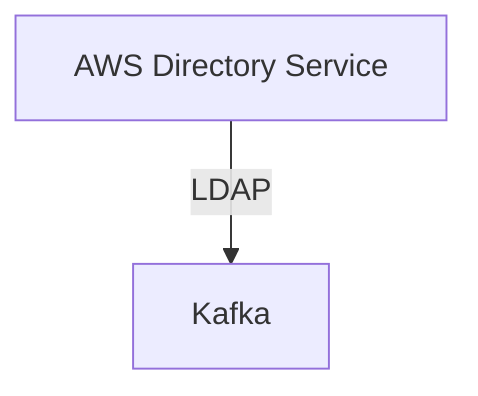

# Connect Kafka to AWS Directory Service

Quix helps you integrate Kafka to AWS Directory Service using pure Python.

- __Find out how we can help you integrate!__

    <a class="md-button md-button--primary" href="https://share.hsforms.com/1iW0TmZzKQMChk0lxd_tGiw4yjw2?__hstc=175542013.2303933fbd746c0ac86d9ccbe9bc9100.1728383268831.1729603416735.1729620918855.31&__hssc=175542013.1.1729620918855&__hsfp=2132701734" target="_blank" style="margin:.5rem;">Book a demo</a>

## AWS Directory Service

AWS Directory Service is a technology provided by Amazon Web Services that allows organizations to easily connect their on-premises Active Directory to the AWS cloud. This service enables users to seamlessly manage and authenticate their users and devices across both environments without the need for complex and time-consuming setup. AWS Directory Service also supports integration with other AWS services, such as Amazon WorkSpaces and Amazon RDS, making it easier for organizations to leverage the benefits of the cloud while maintaining centralized control over their directory services. Additionally, AWS Directory Service offers enhanced security features, automatic backups, and high availability to ensure that organizations can easily scale their directory services as needed.

## Integrations

Quix is a good fit for integrating with AWS Directory Service because it offers a comprehensive platform for developing, deploying, and managing real-time data pipelines that can benefit from the security and compliance features provided by AWS Directory Service. 

With features such as streamlined development and deployment, enhanced collaboration, real-time monitoring, flexible scaling and management, and robust CI/CD processes, Quix can leverage the secure management of secrets and compliance options offered by AWS Directory Service to ensure the protection of sensitive data and adherence to regulatory requirements. 

Additionally, Quix Streams, a cloud-native library for processing data in Kafka using Python, can benefit from the scalability and reliability of AWS Directory Service, allowing users to take advantage of features like serialization and state management, time window aggregations, and resilient scaling in a secure and compliant environment. 

Overall, the combination of Quix's powerful data pipeline development platform and AWS Directory Service's security and compliance features make them a good fit for integration, enabling organizations to efficiently manage and secure their real-time data processing workflows.

