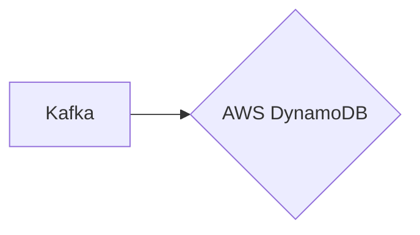

# Connect Kafka to AWS DynamoDB

Quix helps you integrate Kafka to AWS DynamoDB using pure Python.

- __Find out how we can help you integrate!__

    <a class="md-button md-button--primary" href="https://share.hsforms.com/1iW0TmZzKQMChk0lxd_tGiw4yjw2?__hstc=175542013.2303933fbd746c0ac86d9ccbe9bc9100.1728383268831.1729603416735.1729620918855.31&__hssc=175542013.1.1729620918855&__hsfp=2132701734" target="_blank" style="margin:.5rem;">Book a demo</a>

## AWS DynamoDB

AWS DynamoDB is a fully managed NoSQL database service provided by Amazon Web Services (AWS). It is designed to provide high performance, low latency, and seamless scalability for applications that require consistent, single-digit millisecond response times. DynamoDB uses a key-value store model with support for both document and wide-column data structures, allowing for greater flexibility in data modeling. With built-in security features, automatic data replication across multiple availability zones, and the ability to handle massive amounts of data with ease, DynamoDB is an ideal choice for applications that require fast and reliable access to large volumes of data. Its seamless integration with other AWS services makes it a powerful tool for building modern, cloud-native applications.

## Integrations

Quix is a good fit for integrating with AWS DynamoDB because of its streamlined development and deployment features, which would make it easier to create and deploy data pipelines that interact with DynamoDB. The platform's enhanced collaboration capabilities would also be beneficial for teams working on projects that involve DynamoDB, allowing for efficient communication and coordination.

Additionally, Quix's real-time monitoring tools would be useful for tracking the performance of pipelines that leverage DynamoDB, ensuring that data is being processed effectively and in a timely manner. The platform's flexible scaling and management options would also come in handy when working with DynamoDB, as users can easily adjust resources and manage multiple environments as needed.

Furthermore, Quix's security and compliance features would ensure that sensitive data stored in DynamoDB is handled securely and in accordance with regulations. The platform's integration with Git providers like GitHub would facilitate seamless CI/CD processes when deploying pipelines that interact with DynamoDB.

In addition, Quix Streams, with its cloud-native library for processing data in Kafka using Python, could be utilized for integrating with AWS DynamoDB and other data sources. The library's support for serialization and state management, time window aggregations, and seamless integration with the Python ecosystem would enable efficient data processing and analysis when working with DynamoDB.

Overall, Quix's comprehensive platform, with its range of features tailored for developing and managing real-time data pipelines, makes it a good fit for integrating with AWS DynamoDB and leveraging its capabilities for data storage and processing.

