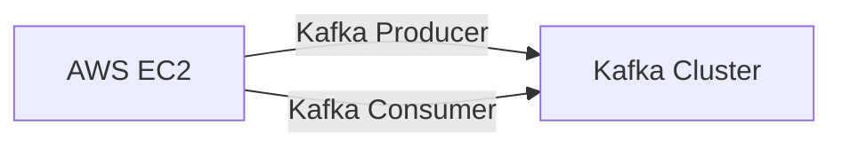

# Connect Kafka to AWS EC2

Quix helps you integrate Kafka to AWS EC2 using pure Python.

<a class="md-button md-button--primary" href="https://share.hsforms.com/1iW0TmZzKQMChk0lxd_tGiw4yjw2?__hstc=175542013.2303933fbd746c0ac86d9ccbe9bc9100.1728383268831.1729603416735.1729620918855.31&__hssc=175542013.1.1729620918855&__hsfp=2132701734" target="_blank" style="margin-right:.5rem;">Book a demo</a>
 

## AWS EC2

Amazon Elastic Compute Cloud (EC2) is a popular cloud computing service provided by Amazon Web Services (AWS). EC2 allows users to rent virtual servers, known as instances, on-demand for various computing needs. These instances can be easily scaled up or down based on the user's requirements, offering flexibility and cost-effectiveness. EC2 also provides a wide range of instance types to cater to different workloads, including general-purpose, compute-optimized, memory-optimized, and storage-optimized instances. Additionally, users have access to a wide selection of operating systems and software applications to run on their EC2 instances. Overall, AWS EC2 is a powerful and versatile technology that enables businesses and individuals to easily deploy and manage virtual servers in the cloud.

## Integrations

Quix is a good fit for integrating with AWS EC2 because of its focus on real-time data pipelines and its ability to streamline development, enhance collaboration, and provide monitoring and scaling capabilities. 

With its streamlined development and deployment features, Quix can easily take advantage of the virtual machine instances provided by AWS EC2 to create and deploy data pipelines. The platform's integration with Git providers like GitHub also aligns well with the CI/CD processes supported by AWS EC2, allowing for seamless automation and synchronization of pipeline deployments.

The real-time monitoring tools offered by Quix, such as logs, metrics, and data exploration, can be further enhanced by utilizing the scalability and flexibility of AWS EC2. Users can easily scale resources, manage CPU and memory, and handle multiple environments linked to Git branches, making it simple to adapt to changing data volumes and processing requirements.

Additionally, Quix's security and compliance features ensure that sensitive data is handled securely when running on AWS EC2 instances. By leveraging dedicated infrastructure options and SLAs provided by AWS, users can meet their compliance requirements and protect their data assets.

The integration of Quix Streams with AWS EC2 also enhances the capabilities of processing data in Kafka using Python. With its compatibility with container orchestration platforms like Kubernetes, Quix Streams can easily run and scale on AWS EC2 instances, ensuring resilient scaling and efficient processing of data streams.

Overall, the combination of Quix's comprehensive platform for data pipeline development and management with the scalability and flexibility of AWS EC2 makes it a well-suited integration for organizations looking to leverage real-time data processing and analysis in the cloud.

