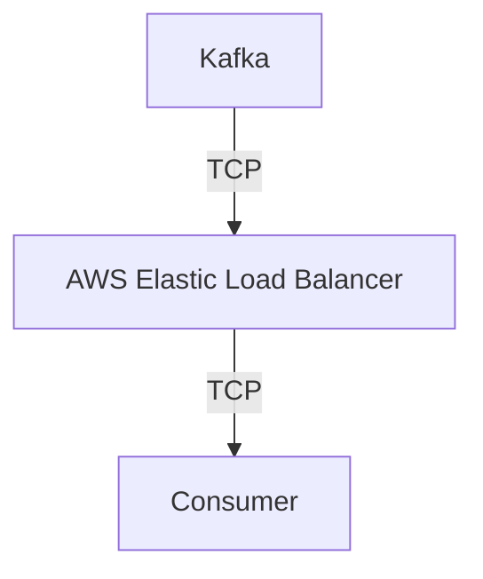

# Connect Kafka to AWS Elastic Load Balancing

Quix helps you integrate Kafka to AWS Elastic Load Balancing using pure Python.

- __Find out how we can help you integrate!__

    <a class="md-button md-button--primary" href="https://share.hsforms.com/1iW0TmZzKQMChk0lxd_tGiw4yjw2?__hstc=175542013.2303933fbd746c0ac86d9ccbe9bc9100.1728383268831.1729603416735.1729620918855.31&__hssc=175542013.1.1729620918855&__hsfp=2132701734" target="_blank" style="margin:.5rem;">Book a demo</a>

## AWS Elastic Load Balancing

AWS Elastic Load Balancing is a service provided by Amazon Web Services that automatically distributes incoming application traffic across multiple targets, such as EC2 instances, containers, and IP addresses. This technology helps ensure that all incoming traffic is evenly distributed to prevent any single target from being overwhelmed. Elastic Load Balancing also continuously monitors the health of targets and automatically routes traffic away from unhealthy targets to maintain high availability and performance. With its ability to seamlessly scale in response to changing traffic patterns, AWS Elastic Load Balancing plays a crucial role in optimizing the performance, reliability, and scalability of applications hosted on the AWS cloud platform.

## Integrations

Quix is a good fit for integrating with AWS Elastic Load Balancing because of its focus on real-time data processing, scalability, and flexibility. Here are some reasons why Quix is well-suited for this integration:

1. Scalability: Quix Cloud allows users to easily scale resources, manage CPU and memory, and handle multiple environments. This aligns well with the scalability features of AWS Elastic Load Balancing, which automatically distributes incoming application traffic across multiple targets to ensure optimal performance and reliability.

2. Real-Time Monitoring: Quix Cloud offers tools for real-time monitoring of pipeline performance and critical metrics. This is essential for ensuring that data pipelines are running smoothly and efficiently, which is crucial when integrating with AWS Elastic Load Balancing to manage traffic load effectively.

3. Integration with Kafka: Quix Cloud supports integration with Kafka, a distributed streaming platform that is often used in conjunction with AWS services. This compatibility allows Quix to seamlessly process data in Kafka using Python, making it easier to integrate with AWS Elastic Load Balancing for efficient data processing and load balancing.

4. Collaboration and Development Tools: Quix Cloud provides features for streamlined development and deployment, enhanced collaboration, and robust CI/CD processes. These capabilities make it easier for teams to work together effectively and deploy data pipelines efficiently, which can be beneficial when integrating with AWS Elastic Load Balancing to manage traffic distribution effectively.

Overall, Quix's focus on real-time data processing, scalability, and collaboration make it a good fit for integrating with AWS Elastic Load Balancing, as both technologies complement each other's capabilities and features.

