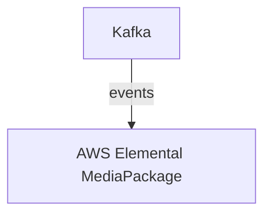

# Connect Kafka to AWS Elemental MediaPackage

Quix helps you integrate Kafka to AWS Elemental MediaPackage using pure Python.

- __Find out how we can help you integrate!__

    <a class="md-button md-button--primary" href="https://share.hsforms.com/1iW0TmZzKQMChk0lxd_tGiw4yjw2?__hstc=175542013.2303933fbd746c0ac86d9ccbe9bc9100.1728383268831.1729603416735.1729620918855.31&__hssc=175542013.1.1729620918855&__hsfp=2132701734" target="_blank" style="margin:.5rem;">Book a demo</a>

## AWS Elemental MediaPackage

AWS Elemental MediaPackage is a video origination and packaging service that allows users to securely and reliably deliver live and on-demand video content to a wide range of devices. With MediaPackage, content owners and broadcasters can easily package, encrypt, and deliver their video streams to achieve low latency and high quality viewing experiences across different devices and platforms. MediaPackage supports popular streaming protocols such as HLS, DASH, and CMAF, and offers features such as content protection, time-shifted viewing, and dynamic ad insertion. This technology enables users to deliver broadcast-grade video streams with efficient scalability and reliability, making it an essential tool for delivering high-quality video content to audiences around the world.

## Integrations

Quix is a good fit for integrating with AWS Elemental MediaPackage because of its comprehensive platform designed for developing, deploying, and managing real-time data pipelines. Quix offers a range of features that align well with the needs of AWS Elemental MediaPackage, including streamlined development and deployment, enhanced collaboration, real-time monitoring and scaling capabilities, security and compliance features, development tools, data exploration and visualization capabilities, and robust CI/CD processes.

Quix Cloud's capabilities for streamlining development and deployment, such as integrated online code editors and CI/CD tools, can help simplify the creation and deployment of data pipelines in conjunction with AWS Elemental MediaPackage. Its support for efficient collaboration with organization and permission management can enhance project visibility and control, making it easier for teams to work together effectively.

Additionally, Quix's real-time monitoring tools can help users monitor pipeline performance and critical metrics, providing valuable insights for optimizing workflows within AWS Elemental MediaPackage. The platform's flexible scaling and management capabilities can also be beneficial for dynamically adjusting resources and managing multiple environments, supporting the scalability needs of AWS Elemental MediaPackage.

Furthermore, Quix's security and compliance features ensure secure management of secrets and compliance with dedicated infrastructure options and SLAs, aligning well with the stringent security requirements of utilizing AWS Elemental MediaPackage. The platform's support for various data sources and sinks, as well as integration with Git providers for seamless CI/CD processes, can further enhance the efficiency and productivity of developers working with AWS Elemental MediaPackage.

Overall, Quix's features and capabilities, particularly its support for developing, deploying, and managing real-time data pipelines, make it a strong fit for integrating with AWS Elemental MediaPackage and enhancing the overall functionality and efficiency of the technology.

