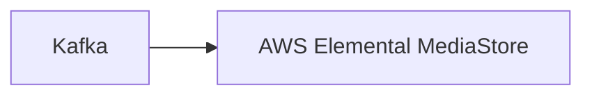

# Connect Kafka to AWS Elemental MediaStore

Quix helps you integrate Kafka to AWS Elemental MediaStore using pure Python.

<a class="md-button md-button--primary" href="https://share.hsforms.com/1iW0TmZzKQMChk0lxd_tGiw4yjw2?__hstc=175542013.2303933fbd746c0ac86d9ccbe9bc9100.1728383268831.1729603416735.1729620918855.31&__hssc=175542013.1.1729620918855&__hsfp=2132701734" target="_blank" style="margin-right:.5rem;">Book a demo</a>
 

## AWS Elemental MediaStore

AWS Elemental MediaStore is a storage service optimized for media that allows users to store and deliver video content with low latency and high performance. It offers secure, durable, and scalable storage that is fully integrated with other AWS services, making it easy to manage and deliver video content to viewers anywhere in the world. With MediaStore, users can efficiently manage large amounts of video assets, deliver high-quality video streams, and protect their content with built-in encryption and access controls. This technology is ideal for media companies, broadcasters, and content creators who need a reliable and cost-effective solution for storing and delivering video content to their audiences.

## Integrations

Quix is a good fit for integrating with AWS Elemental MediaStore because it offers a comprehensive platform for developing, deploying, and managing real-time data pipelines. With its streamlined development and deployment process, Quix makes it easy to create and deploy data pipelines, which aligns well with the need to efficiently manage and process data in AWS Elemental MediaStore.

Additionally, Quix's real-time monitoring capabilities are crucial for monitoring pipeline performance and critical metrics in AWS Elemental MediaStore. The platform's robust CI/CD processes and integration with Git providers also make it easy to manage and continuously improve data pipelines in AWS Elemental MediaStore.

Furthermore, Quix Streams, a cloud-native library for processing data in Kafka using Python, is also a valuable tool for integrating with AWS Elemental MediaStore. Its support for various serialization formats, time window aggregations, and resilient scaling makes it a suitable choice for processing and managing data in AWS Elemental MediaStore.

Overall, Quix's features such as streamlined development, real-time monitoring, and integration with Kafka, coupled with its focus on collaboration, security, and compliance, make it a strong fit for integrating with AWS Elemental MediaStore for managing and processing real-time data pipelines effectively.

