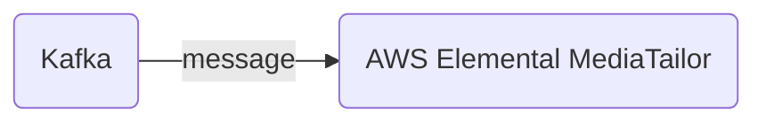

# Connect Kafka to AWS Elemental MediaTailor

Quix helps you integrate Kafka to AWS Elemental MediaTailor using pure Python.

<a class="md-button md-button--primary" href="https://share.hsforms.com/1iW0TmZzKQMChk0lxd_tGiw4yjw2?__hstc=175542013.2303933fbd746c0ac86d9ccbe9bc9100.1728383268831.1729603416735.1729620918855.31&__hssc=175542013.1.1729620918855&__hsfp=2132701734" target="_blank" style="margin-right:.5rem;">Book a demo</a>
 

## AWS Elemental MediaTailor

AWS Elemental MediaTailor is a video ad insertion and monetization technology that allows content providers to individually target and deliver personalized advertisements to viewers across a range of devices. By enabling dynamic ad insertion, MediaTailor enhances the viewer experience by delivering seamless transitions between content and advertisements. This technology also provides detailed analytics and reporting on viewer behavior and ad performance, allowing content providers to optimize their monetization strategies and maximize revenue. With MediaTailor, broadcasters and OTT providers can deliver a targeted, personalized viewing experience that engages viewers and drives advertising revenue.

## Integrations

Quix is a good fit for integrating with AWS Elemental MediaTailor because of its robust features and capabilities that align well with the requirements of integrating with MediaTailor. 

1. Streamlined Development and Deployment: Quix Cloud's integrated online code editors and CI/CD tools simplify the development and deployment of data pipelines, making it easier to build and deploy integration pipelines with AWS Elemental MediaTailor.

2. Real-Time Monitoring: Quix Cloud provides tools for real-time logs, metrics, and data exploration, allowing users to monitor pipeline performance and critical metrics. This real-time monitoring capability is crucial for ensuring the seamless integration of Quix with AWS Elemental MediaTailor.

3. Flexible Scaling and Management: Quix Cloud allows users to easily scale resources, manage CPU and memory, and handle multiple environments linked to Git branches. This flexibility in scaling and management is important when integrating with a large-scale technology like AWS Elemental MediaTailor.

4. Security and Compliance: Quix Cloud ensures secure management of secrets and compliance with dedicated infrastructure options and SLAs, which is crucial for maintaining data security and compliance when integrating with AWS Elemental MediaTailor.

5. Kafka Integration: Quix Cloud supports both Quix-hosted and third-party Kafka solutions, including Confluent Cloud and Redpanda. This compatibility with Kafka makes it easier to integrate Quix with AWS Elemental MediaTailor, which also supports Kafka integration.

6. Quix Streams: Quix Streams, a cloud-native library for processing data in Kafka using Python, can be leveraged to enhance the integration of Quix with AWS Elemental MediaTailor. With features like serialization support, time window aggregations, and resilient scaling, Quix Streams can help streamline the data processing and integration process with MediaTailor.

Overall, the comprehensive features of Quix Cloud, coupled with the capabilities of Quix Streams, make it a suitable choice for integrating with AWS Elemental MediaTailor to enable efficient and seamless data processing and management workflows.

