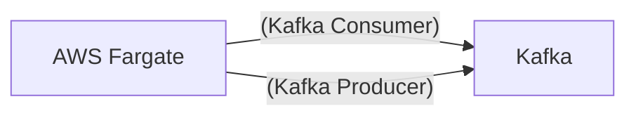

# Connect Kafka to AWS Fargate

Quix helps you integrate Kafka to AWS Fargate using pure Python.

<a class="md-button md-button--primary" href="https://share.hsforms.com/1iW0TmZzKQMChk0lxd_tGiw4yjw2?__hstc=175542013.2303933fbd746c0ac86d9ccbe9bc9100.1728383268831.1729603416735.1729620918855.31&__hssc=175542013.1.1729620918855&__hsfp=2132701734" target="_blank" style="margin-right:.5rem;">Book a demo</a>
 

## AWS Fargate

AWS Fargate is a technology that allows users to run Docker containers without having to manage the underlying infrastructure. With Fargate, users can define their containerized application, specify the CPU and memory resources needed, and AWS Fargate takes care of the rest. This eliminates the need for users to provision and scale virtual machines, making it easier to deploy and manage containerized applications. Fargate is highly scalable and efficient, as it only uses the necessary resources to run the containers, leading to cost savings for users. Overall, AWS Fargate is a powerful and convenient technology for running containers in the cloud.

## Integrations

Quix is a good fit for integrating with AWS Fargate because of its cloud-native approach to developing, deploying, and managing real-time data pipelines. AWS Fargate is a serverless compute engine for containers that enables customers to focus on building applications without managing the underlying infrastructure. By integrating with AWS Fargate, Quix can leverage the scalability and flexibility of container orchestration, allowing users to easily scale resources, manage CPU and memory, and handle multiple environments.

Quix's stream processing capabilities, as demonstrated in Quix Streams, align well with AWS Fargate's container-based architecture. The library's ability to process data in Kafka using Python seamlessly integrates with AWS Fargate's support for containerized applications, allowing users to leverage the scalability of Kafka with a user-friendly Python interface. Quix Streams' support for serialization, state management, time window aggregations, and resilient scaling makes it well-suited for running on AWS Fargate, which can dynamically adjust resources based on workload demands.

Additionally, Quix's comprehensive platform features, such as streamlined development and deployment, real-time monitoring, secure management of secrets, and robust CI/CD processes, complement AWS Fargate's capabilities for managing and running containerized applications. The platform's integration with Git providers like GitHub and Bitbucket, as well as its support for online code editors and CI/CD tools, facilitate efficient collaboration and development workflows in conjunction with AWS Fargate.

Overall, Quix's cloud-native approach to data pipeline development, coupled with its support for stream processing in Kafka using Python, makes it a strong candidate for integrating with AWS Fargate to facilitate the creation, deployment, and management of real-time data pipelines in a scalable and flexible manner.

