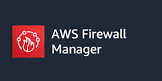
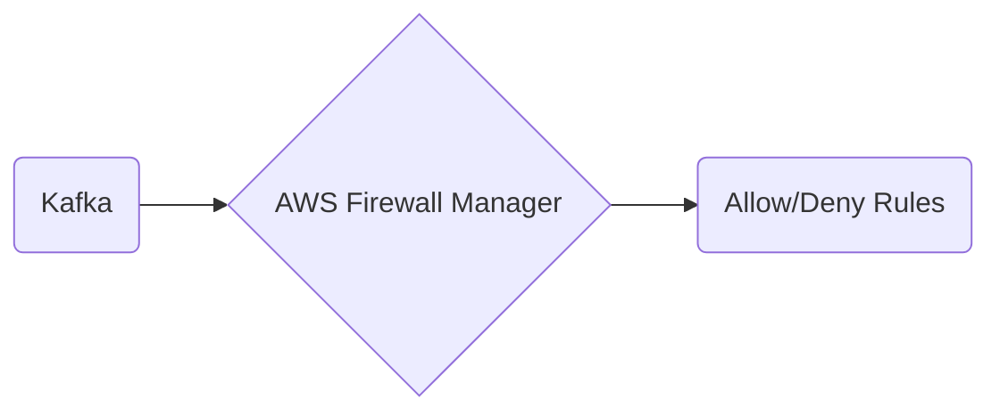

# Connect Kafka to AWS Firewall Manager

Quix helps you integrate Kafka to AWS Firewall Manager using pure Python.

<a class="md-button md-button--primary" href="https://share.hsforms.com/1iW0TmZzKQMChk0lxd_tGiw4yjw2?__hstc=175542013.2303933fbd746c0ac86d9ccbe9bc9100.1728383268831.1729603416735.1729620918855.31&__hssc=175542013.1.1729620918855&__hsfp=2132701734" target="_blank" style="margin-right:.5rem;">Book a demo</a>
 

## AWS Firewall Manager

AWS Firewall Manager is a sophisticated security management tool provided by Amazon Web Services (AWS) that allows users to centrally configure and manage firewall rules across multiple AWS accounts and applications. With AWS Firewall Manager, users can create and enforce security policies, set rules to prevent unauthorized access to resources, and monitor and report on security compliance in real-time. This technology provides a single pane of glass view for all firewall configurations, simplifying the process of managing security across complex and distributed environments. By leveraging AWS Firewall Manager, organizations can enhance their security posture, streamline compliance efforts, and protect their valuable assets from cyber threats.

## Integrations

Quix is a good fit for integrating with AWS Firewall Manager because of its strong emphasis on security and compliance features. As a platform that ensures secure management of secrets and compliance with dedicated infrastructure options and SLAs, Quix aligns well with the requirements for managing firewall rules and policies in a multi-account AWS environment.

Additionally, Quix's robust CI/CD processes and integration with Git providers like GitHub and Bitbucket make it easy to automate the deployment and management of firewall rules using AWS Firewall Manager. The platform's YAML synchronization capabilities also allow for defining firewall rules and policies as code, providing a streamlined approach to managing security configurations.

Furthermore, Quix's support for real-time monitoring and logging, along with its data exploration and visualization tools, can enhance visibility into network traffic and security events within the AWS environment. This can help organizations quickly detect and respond to potential security threats and vulnerabilities, making Quix a valuable asset for integrating with AWS Firewall Manager. 

Overall, Quix's focus on security, compliance, and automation makes it a strong candidate for integrating with AWS Firewall Manager to streamline the management of security policies and ensure a secure and compliant cloud environment.

