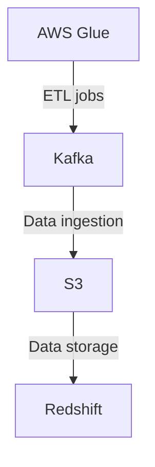

# Connect Kafka to AWS Glue

Quix helps you integrate Kafka to AWS Glue using pure Python.

<a class="md-button md-button--primary" href="https://share.hsforms.com/1iW0TmZzKQMChk0lxd_tGiw4yjw2?__hstc=175542013.2303933fbd746c0ac86d9ccbe9bc9100.1728383268831.1729603416735.1729620918855.31&__hssc=175542013.1.1729620918855&__hsfp=2132701734" target="_blank" style="margin-right:.5rem;">Book a demo</a>
 

## AWS Glue

AWS Glue is a fully managed extract, transform, and load (ETL) service provided by Amazon Web Services (AWS). It allows users to easily prepare and load their data for analysis in data lakes, data warehouses, and other data storage services. AWS Glue automates the process of discovering data sources, converting it into a consistent format, and loading it into the target storage. It is serverless, meaning users do not need to provision or manage any infrastructure, and it can automatically scale to handle large volumes of data. AWS Glue also provides a visual interface for creating data transformation scripts, making it easy for non-technical users to perform complex data transformations.

## Integrations

Quix is a good fit for integrating with AWS Glue because it complements the features and capabilities of AWS Glue with its own strengths in real-time data processing and monitoring. By integrating Quix with AWS Glue, users can benefit from a comprehensive platform for developing, deploying, and managing real-time data pipelines with enhanced collaboration, scalable infrastructure, and advanced monitoring capabilities.

One key advantage of integrating Quix with AWS Glue is the streamlined development and deployment process. Quix offers integrated online code editors and CI/CD tools that simplify the creation and deployment of data pipelines, while AWS Glue provides a scalable and managed environment for running these pipelines. This combination allows users to efficiently develop and deploy data pipelines on AWS Glue using Quix's streamlined tools and workflows.

Furthermore, Quix's real-time monitoring capabilities complement AWS Glue's monitoring features, providing users with tools for monitoring pipeline performance, logs, and metrics in real-time. This integration enhances the visibility and control over data pipelines, enabling users to quickly identify and address any performance or operational issues.

Additionally, Quix's support for flexible scaling and management, security and compliance, and robust CI/CD processes align well with the capabilities of AWS Glue. By integrating Quix with AWS Glue, users can leverage these features to effectively manage resources, ensure data security and compliance, and streamline their CI/CD workflows.

Overall, integrating Quix with AWS Glue can bring together the strengths of both platforms to create a powerful and comprehensive solution for developing, deploying, and managing real-time data pipelines in a scalable and efficient manner.

