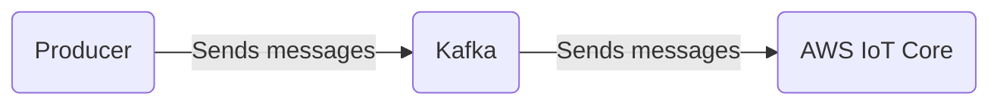

# Connect Kafka to AWS IoT Core

Quix helps you integrate Kafka to AWS IoT Core using pure Python.

- __Find out how we can help you integrate!__

    <a class="md-button md-button--primary" href="https://share.hsforms.com/1iW0TmZzKQMChk0lxd_tGiw4yjw2?__hstc=175542013.2303933fbd746c0ac86d9ccbe9bc9100.1728383268831.1729603416735.1729620918855.31&__hssc=175542013.1.1729620918855&__hsfp=2132701734" target="_blank" style="margin:.5rem;">Book a demo</a>

## AWS IoT Core

AWS IoT Core is a technology developed by Amazon Web Services that provides a platform for connecting devices to the cloud. It allows for secure and bi-directional communication between devices and the cloud, making it easier to collect, manage, and analyze data from connected devices. With AWS IoT Core, users can create rules to trigger actions based on data received from devices, as well as securely and efficiently manage large fleets of devices. This technology is scalable and highly reliable, making it ideal for a wide range of IoT applications across industries such as manufacturing, healthcare, transportation, and smart home automation.

## Integrations

Quix is a good fit for integrating with AWS IoT Core because it provides a comprehensive platform for developing, deploying, and managing real-time data pipelines. AWS IoT Core is a managed cloud service that allows devices to connect securely to the cloud and interact with the Internet of Things. By integrating with Quix, users can leverage its streamlined development and deployment tools to easily create and deploy data pipelines that connect to AWS IoT Core.

Furthermore, Quix's real-time monitoring capabilities complement AWS IoT Core's monitoring features, allowing users to monitor pipeline performance and critical metrics in real-time. The platform's flexible scaling and management tools also align well with AWS IoT Core's scalability, allowing users to easily scale resources and manage multiple environments linked to Git branches.

Additionally, Quix's security and compliance features ensure that data flowing through the pipelines remains secure and compliant with regulations. By leveraging Quix Streams, users can process data in Kafka using Python, benefiting from its scalability and user-friendly interface.

Overall, the combination of Quix's feature set with AWS IoT Core's capabilities makes for a powerful integration that enables efficient development, monitoring, and management of IoT data pipelines.

