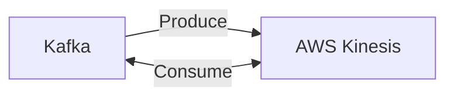

# Connect Kafka to AWS Kinesis

Quix helps you integrate Kafka to AWS Kinesis using pure Python.

- __Find out how we can help you integrate!__

    <a class="md-button md-button--primary" href="https://share.hsforms.com/1iW0TmZzKQMChk0lxd_tGiw4yjw2?__hstc=175542013.2303933fbd746c0ac86d9ccbe9bc9100.1728383268831.1729603416735.1729620918855.31&__hssc=175542013.1.1729620918855&__hsfp=2132701734" target="_blank" style="margin:.5rem;">Book a demo</a>

## AWS Kinesis

AWS Kinesis is a real-time data streaming service provided by Amazon Web Services (AWS). It allows users to collect, process, and analyze streaming data in real-time, making it ideal for applications that require instantaneous data insights. With Kinesis, users can easily ingest data from various sources, such as websites, mobile apps, and IoT devices, and then analyze this data using powerful tools like Amazon Kinesis Data Analytics and Amazon Kinesis Data Firehose. This technology is highly scalable, reliable, and cost-effective, making it a popular choice for companies looking to build data-driven applications that require real-time processing capabilities.

## Integrations

Quix is a good fit for integrating with AWS Kinesis due to its comprehensive platform designed for developing, deploying, and managing real-time data pipelines. Here are a few reasons why Quix is a good fit for integrating with AWS Kinesis:

1. Streamlined Development and Deployment: Quix offers integrated online code editors and CI/CD tools that simplify the creation and deployment of data pipelines. This aligns well with AWS Kinesis, which is a platform for streaming and processing real-time data.

2. Enhanced Collaboration: Quix supports efficient collaboration with organization and permission management, increasing project visibility and control. This can help teams working with AWS Kinesis to streamline their development processes and ensure smooth collaboration.

3. Real-Time Monitoring: Quix Cloud provides tools for real-time logs, metrics, and data exploration, allowing users to monitor pipeline performance and critical metrics. This complements AWS Kinesis' real-time data processing capabilities, enabling users to monitor and optimize their data pipelines effectively.

4. Flexible Scaling and Management: Quix offers easy resource scaling, CPU and memory management, and multiple environment handling linked to Git branches. This aligns well with AWS Kinesis, which allows users to easily scale their data processing resources based on demand.

Overall, the combination of Quix's features for developing, deploying, and managing real-time data pipelines with AWS Kinesis' capabilities for streaming and processing real-time data makes it a well-suited choice for organizations looking to integrate these technologies.

