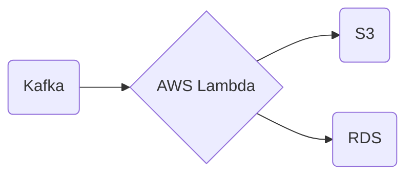

# Connect Kafka to AWS Lambda

Quix helps you integrate Kafka to AWS Lambda using pure Python.

<a class="md-button md-button--primary" href="https://share.hsforms.com/1iW0TmZzKQMChk0lxd_tGiw4yjw2?__hstc=175542013.2303933fbd746c0ac86d9ccbe9bc9100.1728383268831.1729603416735.1729620918855.31&__hssc=175542013.1.1729620918855&__hsfp=2132701734" target="_blank" style="margin-right:.5rem;">Book a demo</a>
 

## AWS Lambda

AWS Lambda is a serverless computing service provided by Amazon Web Services (AWS) that allows users to run code without provisioning or managing servers. With Lambda, users can simply upload their code and the service will automatically scale to handle the application's workload. Lambda supports a variety of programming languages and can be used to run code in response to events triggered by other AWS services or HTTP requests. This technology is highly flexible, cost-effective, and scalable, making it an ideal solution for developers looking to build applications quickly and efficiently.

## Integrations

Quix is a good fit for integrating with AWS Lambda because of its emphasis on real-time data processing and management. AWS Lambda is a serverless computing service provided by Amazon Web Services, which allows users to run code in response to events and automatically manage the computing resources required by that code.

Quix's real-time monitoring capabilities align well with AWS Lambda's event-driven architecture, as users can easily monitor pipeline performance and critical metrics in real-time. Additionally, Quix's streamlined development and deployment features, such as integrated online code editors and CI/CD tools, make it easy to create and deploy data pipelines in a serverless environment like AWS Lambda.

Furthermore, Quix's flexible scaling and management options complement AWS Lambda's ability to dynamically scale resources based on workload demands. Users can easily scale resources, manage CPU and memory, and handle multiple environments linked to Git branches, ensuring efficient and cost-effective resource utilization within AWS Lambda.

Overall, Quix's focus on real-time data processing, collaboration, and monitoring capabilities make it a suitable platform for integrating with AWS Lambda for seamless and efficient data pipeline development and deployment in a serverless architecture.

