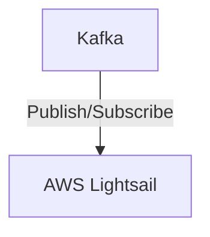

# Connect Kafka to AWS Lightsail

Quix helps you integrate Kafka to AWS Lightsail using pure Python.

<a class="md-button md-button--primary" href="https://share.hsforms.com/1iW0TmZzKQMChk0lxd_tGiw4yjw2?__hstc=175542013.2303933fbd746c0ac86d9ccbe9bc9100.1728383268831.1729603416735.1729620918855.31&__hssc=175542013.1.1729620918855&__hsfp=2132701734" target="_blank" style="margin-right:.5rem;">Book a demo</a>
 

## AWS Lightsail

AWS Lightsail is a virtual private server service offered by Amazon Web Services (AWS) that allows users to easily deploy and manage virtual private servers in the cloud. With Lightsail, users can launch pre-configured virtual servers with just a few clicks, making it ideal for developers, small businesses, and individuals who want a simple and cost-effective way to host websites, applications, and other services. Lightsail offers a range of server configurations, including different operating systems, storage sizes, and networking options, giving users the flexibility to choose the resources that best fit their needs. Additionally, Lightsail provides built-in monitoring and alerting tools, along with easy-to-use management interfaces, making it easy for users to scale their servers up or down as needed. Overall, AWS Lightsail provides a hassle-free and affordable solution for those looking to quickly deploy and manage virtual servers in the cloud.

## Integrations

Quix is a good fit for integrating with AWS Lightsail for a variety of reasons:

1. Streamlined Development and Deployment: Quix's integrated online code editors and CI/CD tools align well with the simplicity and ease of use offered by AWS Lightsail. This combination would make it easy for developers to create and deploy data pipelines efficiently.

2. Enhanced Collaboration: Quix's support for organization and permission management complements AWS Lightsail's capabilities, enabling teams to work together effectively on data pipeline projects.

3. Real-Time Monitoring: Quix Cloud's tools for real-time logs and metrics align well with the monitoring capabilities provided by AWS Lightsail, allowing users to easily monitor pipeline performance and make necessary adjustments.

4. Flexible Scaling and Management: With the ability to scale resources and handle multiple environments, Quix can seamlessly integrate with AWS Lightsail's flexible scaling options, providing users with the ability to manage CPU and memory as needed.

5. Security and Compliance: Both Quix and AWS Lightsail prioritize security and compliance, ensuring that data handling is done in a secure and compliant manner. This alignment is essential for businesses operating in regulated industries.

6. Development Tools: Quix Cloud's online code editors and connectors for various data sources complement the development capabilities of AWS Lightsail, providing users with a comprehensive set of tools for building and managing data pipelines.

7. Kafka Integration: Quix's support for Kafka, including both Quix-hosted and third-party solutions, can leverage AWS Lightsail's infrastructure to create scalable and reliable Kafka-based data pipelines.

In conclusion, Quix's comprehensive platform for developing, deploying, and managing real-time data pipelines aligns well with the capabilities of AWS Lightsail, making it a good fit for integrating with this technology. By leveraging the strengths of both platforms, users can benefit from enhanced collaboration, streamlined development and deployment processes, real-time monitoring, flexible scaling options, and robust security and compliance features.

