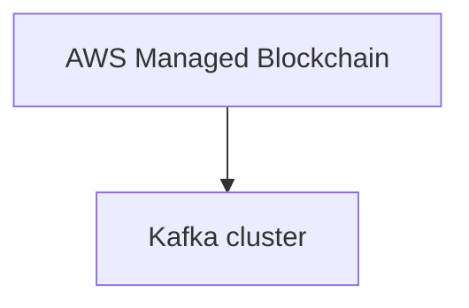

# Connect Kafka to AWS Managed Blockchain

Quix helps you integrate Kafka to AWS Managed Blockchain using pure Python.

- __Find out how we can help you integrate!__

    <a class="md-button md-button--primary" href="https://share.hsforms.com/1iW0TmZzKQMChk0lxd_tGiw4yjw2?__hstc=175542013.2303933fbd746c0ac86d9ccbe9bc9100.1728383268831.1729603416735.1729620918855.31&__hssc=175542013.1.1729620918855&__hsfp=2132701734" target="_blank" style="margin:.5rem;">Book a demo</a>

## AWS Managed Blockchain

AWS Managed Blockchain is a cloud-based service that allows users to create and manage blockchain networks. With this technology, users can easily set up and deploy secure and scalable blockchain networks without having to worry about the underlying infrastructure. AWS takes care of the heavy lifting, such as provisioning nodes, managing certificates, and handling the encryption keys. This allows users to focus on developing their applications and smart contracts, while AWS ensures the network is secure and resilient. With AWS Managed Blockchain, users can take advantage of the benefits of blockchain technology, such as transparency, immutability, and decentralization, without the complexity of managing a blockchain network on their own.

## Integrations

Quix is a good fit for integrating with AWS Managed Blockchain because it offers a range of features that complement the capabilities of this technology. 

Firstly, Quix Cloud's streamlined development and deployment tools can help simplify the creation and deployment of data pipelines on AWS Managed Blockchain. The integrated online code editors and CI/CD tools make it easier to build and manage real-time data pipelines in a blockchain environment.

Additionally, Quix Cloud's real-time monitoring and scaling capabilities are essential for monitoring the performance of data pipelines on AWS Managed Blockchain. With tools for real-time logs, metrics, and data exploration, users can effectively monitor pipeline performance and make necessary adjustments to scale resources as needed.

Moreover, Quix Cloud's security and compliance features ensure that the data processed on AWS Managed Blockchain is securely managed and compliant with regulations. This is crucial for organizations working with sensitive data on a blockchain platform.

Lastly, Quix Streams' integration with Kafka can further enhance the capabilities of AWS Managed Blockchain by providing a cloud-native library for processing data in a scalable and user-friendly manner. This integration allows for seamless data processing and analysis within a blockchain environment.

Overall, Quix's comprehensive platform and features make it a strong candidate for integrating with AWS Managed Blockchain, providing users with the tools they need to develop, deploy, and manage real-time data pipelines in a blockchain environment.

