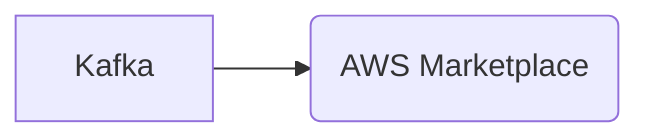

# Connect Kafka to AWS Marketplace

Quix helps you integrate Kafka to AWS Marketplace using pure Python.

<a class="md-button md-button--primary" href="https://share.hsforms.com/1iW0TmZzKQMChk0lxd_tGiw4yjw2?__hstc=175542013.2303933fbd746c0ac86d9ccbe9bc9100.1728383268831.1729603416735.1729620918855.31&__hssc=175542013.1.1729620918855&__hsfp=2132701734" target="_blank" style="margin-right:.5rem;">Book a demo</a>
 

## AWS Marketplace

AWS Marketplace is a digital catalog that enables customers to find, buy, and deploy software solutions that run on Amazon Web Services (AWS). With a wide range of software products and services from vendors across various categories like security, data, machine learning, analytics, and more, customers can easily browse, compare, and purchase the tools they need to enhance their AWS environment. AWS Marketplace also offers a convenient pay-as-you-go pricing model, allowing customers to only pay for the software they use without any upfront costs or long-term commitments. This marketplace simplifies the procurement process, accelerates software deployment, and promotes innovation by providing customers with access to a diverse selection of trusted software solutions.

## Integrations

Quix is a good fit for integrating with AWS Marketplace due to its comprehensive platform for developing, deploying, and managing real-time data pipelines. The key components of Quix, such as streamlined development and deployment, enhanced collaboration, real-time monitoring, and flexible scaling and management, align well with the needs of AWS Marketplace customers looking for efficient and scalable solutions for their data processing needs.

Quix Cloud's support for organization and permission management, real-time logs and metrics, and secure management of secrets also makes it a suitable choice for customers concerned about security and compliance requirements. Additionally, Quix's integration with Git providers and dedicated infrastructure options further enhances its appeal for customers looking to streamline their CI/CD processes and ensure reliable performance.

Furthermore, Quix Streams, with its cloud-native library for processing data in Kafka using Python, provides additional benefits such as seamless integration with popular Python libraries, support for various serialization formats, time window aggregations, and resilient scaling via container orchestration. This makes Quix a versatile and user-friendly option for customers looking to leverage the scalability of Kafka while utilizing the flexibility and ease of use of Python.

Overall, Quix's robust feature set, including its support for real-time data processing, seamless collaboration, and secure management, makes it a strong contender for integration with AWS Marketplace, providing customers with a reliable and efficient solution for their data processing needs.

