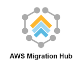
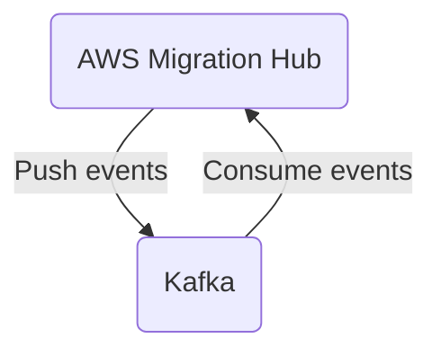

# Connect Kafka to AWS Migration Hub

Quix helps you integrate Kafka to AWS Migration Hub using pure Python.

<a class="md-button md-button--primary" href="https://share.hsforms.com/1iW0TmZzKQMChk0lxd_tGiw4yjw2?__hstc=175542013.2303933fbd746c0ac86d9ccbe9bc9100.1728383268831.1729603416735.1729620918855.31&__hssc=175542013.1.1729620918855&__hsfp=2132701734" target="_blank" style="margin-right:.5rem;">Book a demo</a>
 

## AWS Migration Hub

AWS Migration Hub is a technology that simplifies and streamlines the process of migrating applications and data to the Amazon Web Services (AWS) cloud platform. It provides a central hub where users can track the progress of their migration projects, monitor the status of their applications and databases, and troubleshoot any issues that may arise during the migration process. By providing a single dashboard for managing all migration activities, AWS Migration Hub helps users ensure a smooth and efficient transition to the cloud, minimizing downtime and reducing the risks associated with migration projects. With its comprehensive set of tools and features, AWS Migration Hub is an essential tool for organizations looking to leverage the power and scalability of the AWS cloud.

## Integrations

Quix is a good fit for integrating with AWS Migration Hub because of its robust development and deployment features, real-time monitoring capabilities, and flexible scaling options. Here are a few reasons why Quix would work well with AWS Migration Hub:

1. Streamlined Development and Deployment: Quix Cloud's integrated online code editors and CI/CD tools would make it easy to create and deploy data pipelines, aligning well with the need for seamless migration of workloads to AWS.

2. Real-Time Monitoring: Quix Cloud's tools for real-time logs, metrics, and data exploration would complement AWS Migration Hub's monitoring capabilities, providing users with visibility into pipeline performance and critical metrics during the migration process.

3. Flexible Scaling and Management: Quix Cloud's ability to easily scale resources and handle multiple environments would be beneficial when migrating workloads to different AWS environments, ensuring a smooth and efficient process.

4. Security and Compliance: Quix Cloud's secure management of secrets and compliance features align with AWS Migration Hub's focus on security and compliance, ensuring that data remains secure during the migration process.

5. Kafka Integration: Quix Cloud's support for Kafka solutions, including both Quix-hosted and third-party options, would be valuable for organizations using Kafka in their data pipelines and looking to migrate those workloads to AWS.

In addition, Quix Streams' cloud-native library for processing data in Kafka using Python could further enhance the capabilities of AWS Migration Hub, providing additional flexibility and ease of use for organizations looking to migrate their data processing workloads to AWS.

