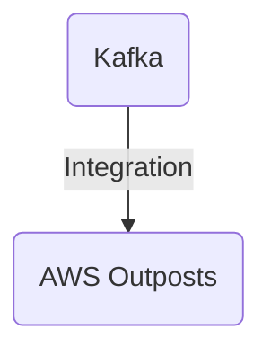

# Connect Kafka to AWS Outposts

Quix helps you integrate Kafka to AWS Outposts using pure Python.

<a class="md-button md-button--primary" href="https://share.hsforms.com/1iW0TmZzKQMChk0lxd_tGiw4yjw2?__hstc=175542013.2303933fbd746c0ac86d9ccbe9bc9100.1728383268831.1729603416735.1729620918855.31&__hssc=175542013.1.1729620918855&__hsfp=2132701734" target="_blank" style="margin-right:.5rem;">Book a demo</a>
 

## AWS Outposts

AWS Outposts is a revolutionary technology that brings the power of cloud computing directly to customers' on-premises data centers. By extending the AWS infrastructure to any physical location, Outposts allows organizations to leverage the benefits of cloud services without relinquishing control over their data and applications. This fully managed service provides the same hardware and software as AWS's public cloud, enabling seamless integration with existing applications and workflows. With AWS Outposts, customers can enjoy the scalability, security, and efficiency of the cloud while maintaining compliance and data sovereignty requirements within their own infrastructure.

## Integrations

Quix is a good fit for integrating with AWS Outposts due to its comprehensive platform designed for developing, deploying, and managing real-time data pipelines. Here are a few reasons why Quix is a good fit for integrating with AWS Outposts:

1. Streamlined Development and Deployment: Quix Cloud's integrated online code editors and CI/CD tools simplify the creation and deployment of data pipelines, making it easier to develop and deploy applications on AWS Outposts.

2. Flexible Scaling and Management: Quix Cloud allows users to easily scale resources, manage CPU and memory, and handle multiple environments linked to Git branches, which aligns well with the scalability and management capabilities offered by AWS Outposts.

3. Security and Compliance: Quix Cloud ensures secure management of secrets and compliance with dedicated infrastructure options and SLAs, which is critical for integrating with AWS Outposts and maintaining data security and compliance.

4. Kafka Integration: Quix Cloud supports both Quix-hosted and third-party Kafka solutions, including Confluent Cloud and Redpanda, which is beneficial for integrating with Kafka on AWS Outposts and leveraging its scalability and real-time data processing capabilities.

5. Dedicated/BYOC Options: Quix Cloud offers options for running pipelines on dedicated infrastructure, with historical logs and metrics visualization through Grafana dashboards, which aligns well with the dedicated infrastructure options available with AWS Outposts.

Overall, Quix's features such as streamlined development and deployment, flexible scaling and management, security and compliance capabilities, Kafka integration, and dedicated infrastructure options make it a good fit for integrating with AWS Outposts and leveraging its capabilities for real-time data processing and management.

