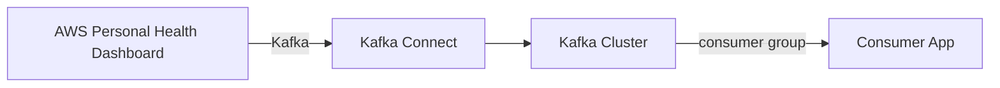

# Connect Kafka to AWS Personal Health Dashboard

Quix helps you integrate Kafka to AWS Personal Health Dashboard using pure Python.

<a class="md-button md-button--primary" href="https://share.hsforms.com/1iW0TmZzKQMChk0lxd_tGiw4yjw2?__hstc=175542013.2303933fbd746c0ac86d9ccbe9bc9100.1728383268831.1729603416735.1729620918855.31&__hssc=175542013.1.1729620918855&__hsfp=2132701734" target="_blank" style="margin-right:.5rem;">Book a demo</a>
 

## AWS Personal Health Dashboard

The AWS Personal Health Dashboard is a service provided by Amazon Web Services that allows users to stay informed about the status of their AWS resources. It provides personalized information about events that may impact the performance, security, or availability of their resources, helping users to quickly identify and troubleshoot any issues that may arise. The dashboard includes alerts and notifications, as well as recommendations for steps to resolve any problems. With this tool, users can proactively monitor and manage their AWS environment, ensuring that their resources are always operating at peak efficiency.

## Integrations

Quix is a good fit for integrating with AWS Personal Health Dashboard because of its robust features that align well with the requirements of the technology. 

Firstly, Quix offers streamlined development and deployment capabilities, which can help in quickly setting up and managing real-time data pipelines within the AWS environment. This would ensure efficient data processing and monitoring for health status updates.

Additionally, Quix provides real-time monitoring tools that allow users to ensure optimal performance and critical metric tracking. This aligns with the need for real-time monitoring within the AWS Personal Health Dashboard to identify and address any issues promptly.

Furthermore, the flexible scaling and management offered by Quix would be valuable for adapting to changing demands within the AWS environment. This would allow for seamless scaling of resources and efficient management of CPU and memory, enhancing the overall performance of the data pipelines.

Lastly, with Quix Streams, the cloud-native library for processing data in Kafka using Python, users can benefit from the seamless integration with Python libraries like Pandas, scikit-learn, and more. This compatibility facilitates data processing and analysis, making it easier to derive insights from the data within the AWS Personal Health Dashboard.

Overall, Quix's features, such as streamlined development, real-time monitoring, flexible scaling, and Python ecosystem integration with Quix Streams, make it a suitable choice for integrating with AWS Personal Health Dashboard to optimize data processing and monitoring capabilities.

