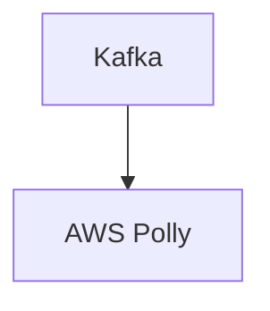

# Connect Kafka to AWS Polly

Quix helps you integrate Kafka to AWS Polly using pure Python.

<a class="md-button md-button--primary" href="https://share.hsforms.com/1iW0TmZzKQMChk0lxd_tGiw4yjw2?__hstc=175542013.2303933fbd746c0ac86d9ccbe9bc9100.1728383268831.1729603416735.1729620918855.31&__hssc=175542013.1.1729620918855&__hsfp=2132701734" target="_blank" style="margin-right:.5rem;">Book a demo</a>
 

## AWS Polly

AWS Polly is a text-to-speech service offered by Amazon Web Services that allows users to convert written text into natural-sounding speech in a variety of languages and voices. Using advanced deep learning technologies, Polly can generate lifelike speech that is indistinguishable from human speech, with features such as intonation, rhythm, and emotion. Users can customize the voice, pronunciation, and volume of the speech output to create a personalized and engaging listening experience. With Polly, businesses can enhance their products and services by adding voice capabilities, improve accessibility for users with disabilities, and create interactive and engaging experiences for their customers.

## Integrations

Quix is a good fit for integrating with AWS Polly because it provides a comprehensive platform for developing, deploying, and managing real-time data pipelines. With its streamlined development and deployment features, users can easily create and deploy pipelines, which is essential for integrating with external technologies like AWS Polly. Additionally, Quix Cloud offers enhanced collaboration capabilities, allowing for efficient project management and visibility.

Furthermore, Quix Cloud's real-time monitoring tools can be leveraged to track the performance of pipelines integrating with AWS Polly, ensuring smooth operation and troubleshooting if needed. The platform's flexible scaling and management options also make it well-suited for handling the processing load required for integrating with AWS Polly.

In addition, Quix Streams, a cloud-native library for processing data in Kafka using Python, further enhances the capabilities of Quix for integrating with AWS Polly. With its Python ecosystem integration and support for serialization, state management, and time window aggregations, Quix Streams provides the necessary tools for efficient data processing and integration with AWS Polly.

Overall, Quix's features align well with the requirements for integrating with AWS Polly, making it a suitable choice for organizations looking to enhance their data processing capabilities with real-time speech synthesis technology.

