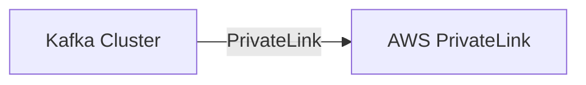

# Connect Kafka to AWS PrivateLink

Quix helps you integrate Kafka to AWS PrivateLink using pure Python.

<a class="md-button md-button--primary" href="https://share.hsforms.com/1iW0TmZzKQMChk0lxd_tGiw4yjw2?__hstc=175542013.2303933fbd746c0ac86d9ccbe9bc9100.1728383268831.1729603416735.1729620918855.31&__hssc=175542013.1.1729620918855&__hsfp=2132701734" target="_blank" style="margin-right:.5rem;">Book a demo</a>
 

## AWS PrivateLink

AWS PrivateLink is a technology that allows users to securely connect their virtual private cloud (VPC) to AWS services or other SaaS providers without exposing their data to the public internet. It creates a private connection between the VPC and the service, enabling data to be transmitted securely and efficiently. This provides increased security and privacy for sensitive data and applications, as well as improved network performance. AWS PrivateLink also simplifies the networking configuration process, making it easy for users to set up and manage connections with minimal effort. Overall, AWS PrivateLink is a powerful tool for organizations looking to enhance the security and efficiency of their cloud infrastructure.

## Integrations

Quix is a good fit for integrating with AWS PrivateLink because of its comprehensive platform designed for developing, deploying, and managing real-time data pipelines. Quix Cloud offers a range of features that align well with the capabilities of AWS PrivateLink.

Firstly, Quix's streamlined development and deployment features, such as integrated online code editors and CI/CD tools, make it easy to create and deploy data pipelines. By integrating with AWS PrivateLink, Quix can securely access AWS services and resources without exposing sensitive data to the public internet, ensuring a seamless and secure development and deployment process.

Additionally, Quix's real-time monitoring and scaling capabilities complement AWS PrivateLink's ability to scale resources and manage CPU and memory efficiently. By leveraging AWS PrivateLink's flexible scaling options, Quix users can easily adjust resources and handle multiple environments linked to Git branches, enhancing the platform's scalability and management capabilities.

Furthermore, Quix's security and compliance features, including secure management of secrets and compliance with dedicated infrastructure options, align well with the secure networking capabilities of AWS PrivateLink. By utilizing AWS PrivateLink, Quix can ensure that data pipelines are securely isolated within a private network, safeguarding sensitive data and ensuring compliance with regulatory requirements.

Overall, integrating Quix with AWS PrivateLink enhances the platform's security, scalability, and management capabilities, making it a strong fit for organizations looking to streamline their data pipeline development and deployment processes while ensuring secure access to AWS services.

