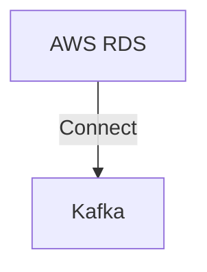

# Connect Kafka to AWS RDS

Quix helps you integrate Kafka to AWS RDS using pure Python.

<a class="md-button md-button--primary" href="https://share.hsforms.com/1iW0TmZzKQMChk0lxd_tGiw4yjw2?__hstc=175542013.2303933fbd746c0ac86d9ccbe9bc9100.1728383268831.1729603416735.1729620918855.31&__hssc=175542013.1.1729620918855&__hsfp=2132701734" target="_blank" style="margin-right:.5rem;">Book a demo</a>
 

## AWS RDS

AWS RDS, or Amazon Web Services Relational Database Service, is a cloud-based service offered by Amazon that allows users to easily set up, operate, and scale relational databases in the cloud. With RDS, users can choose from various popular database engines such as MySQL, PostgreSQL, Oracle, and SQL Server, and have access to automated backups, high availability, and security features. RDS makes it simple to manage databases without the need to worry about infrastructure provisioning, patching, or backups, making it an efficient and cost-effective solution for businesses of all sizes.

## Integrations

Quix is a good fit for integrating with AWS RDS because of its seamless integration with various data sources and sinks, including third-party Kafka solutions like Confluent Cloud and Redpanda. This compatibility with Kafka makes it easy for Quix to ingest data from AWS RDS into data pipelines without requiring a JVM or server-side engine.

Additionally, Quix's support for Python ecosystems and libraries like Pandas, scikit-learn, TensorFlow, and PyTorch make it easy to work with data from AWS RDS in a familiar and user-friendly environment. The platform's serialization and state management capabilities, as well as its time window aggregations and resilient scaling via container orchestration, further enhance its ability to process and analyze data from AWS RDS efficiently.

Furthermore, Quix's dedicated infrastructure options, secure management of secrets, and compliance features make it a secure and reliable choice for integrating with sensitive data stored in AWS RDS. The platform's real-time monitoring, logs, and metrics exploration tools also provide valuable insights into pipeline performance when working with data from AWS RDS. Overall, Quix's comprehensive features and flexibility make it a strong candidate for integrating with AWS RDS for developing, deploying, and managing real-time data pipelines.

