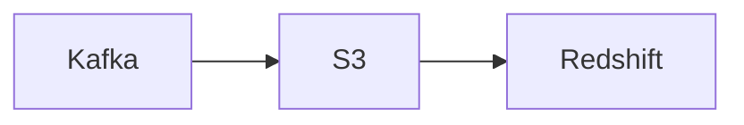

# Connect Kafka to AWS Redshift

Quix helps you integrate Kafka to AWS Redshift using pure Python.

<a class="md-button md-button--primary" href="https://share.hsforms.com/1iW0TmZzKQMChk0lxd_tGiw4yjw2?__hstc=175542013.2303933fbd746c0ac86d9ccbe9bc9100.1728383268831.1729603416735.1729620918855.31&__hssc=175542013.1.1729620918855&__hsfp=2132701734" target="_blank" style="margin-right:.5rem;">Book a demo</a>
 

## AWS Redshift

AWS Redshift is a powerful and fully managed data warehouse service provided by Amazon Web Services. It is designed for analyzing large datasets and delivering high-performance and scalable analytics. Redshift uses columnar storage and massively parallel processing (MPP) to efficiently store and query data. It can easily handle petabyte-scale data and is ideal for organizations looking to run complex queries across vast amounts of data quickly. With features such as automatic backups, encryption, and seamless integration with other AWS services, Redshift offers a cost-effective and user-friendly solution for businesses looking to derive valuable insights from their data.

## Integrations

Quix is a good fit for integrating with AWS Redshift because of its comprehensive platform designed for developing, deploying, and managing real-time data pipelines. With key components such as streamlined development and deployment, enhanced collaboration, real-time monitoring, flexible scaling and management, and security and compliance, Quix can easily integrate with AWS Redshift to streamline the process of creating and managing data pipelines.

Additionally, Quix Cloud offers integration with Kafka, which is supported by AWS Redshift for data streaming capabilities. Quix Streams, a cloud-native library for processing data in Kafka using Python, can seamlessly work with AWS Redshift to handle data processing and analytics tasks efficiently.

With its features like no JVM requirement, Python ecosystem integration, serialization and state management, time window aggregations, resilient scaling, and support for local and Jupyter Notebook development, Quix makes it easy to work with AWS Redshift for real-time data processing and analytics. By leveraging Quix's capabilities, organizations can efficiently integrate and manage their data pipelines with AWS Redshift for enhanced performance and scalability.

