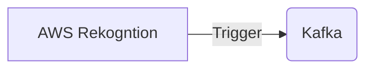

# Connect Kafka to AWS Rekognition

Quix helps you integrate Kafka to AWS Rekognition using pure Python.

- __Find out how we can help you integrate!__

    <a class="md-button md-button--primary" href="https://share.hsforms.com/1iW0TmZzKQMChk0lxd_tGiw4yjw2?__hstc=175542013.2303933fbd746c0ac86d9ccbe9bc9100.1728383268831.1729603416735.1729620918855.31&__hssc=175542013.1.1729620918855&__hsfp=2132701734" target="_blank" style="margin:.5rem;">Book a demo</a>

## AWS Rekognition

AWS Rekognition is a sophisticated image and video analysis technology developed by Amazon Web Services. It utilizes deep learning models to extract valuable insights from visual content, such as identifying objects, scenes, and faces within images and videos. Rekognition can also recognize text in images, detect inappropriate content, and analyze facial attributes like emotions and facial landmarks. This powerful technology enables businesses to automate tasks like content moderation, sentiment analysis, and object recognition, ultimately improving efficiency and accuracy in various applications such as content management, security, and customer engagement.

## Integrations

Quix is a good fit for integrating with AWS Rekognition because of its robust development and deployment capabilities, real-time monitoring features, and flexible scaling options. 

1. Streamlined Development and Deployment: Quix Cloud's integrated online code editors and CI/CD tools make it easy to create and deploy data pipelines, which is essential when integrating with AWS Rekognition's image and video analysis capabilities.

2. Enhanced Collaboration: Quix Cloud allows for efficient collaboration with organization and permission management, increasing project visibility and control. This is crucial when working on projects that require integration with complex AI technologies like AWS Rekognition.

3. Real-Time Monitoring: Quix Cloud provides tools for real-time logs, metrics, and data exploration, allowing users to monitor pipeline performance and critical metrics. This is important for ensuring the smooth operation of AWS Rekognition integrations.

4. Flexible Scaling and Management: Quix Cloud makes it easy to scale resources, manage CPU and memory, and handle multiple environments, which is essential for handling the large amounts of data processed by AWS Rekognition.

Additionally, Quix Streams, with its cloud-native library for processing data in Kafka using Python, can be used in conjunction with AWS Rekognition to handle data processing and analysis tasks efficiently. Its Python ecosystem integration and support for serialization formats and stateful operations make it a valuable tool for working with AWS Rekognition's output data. 

Overall, the combination of Quix Cloud's development and monitoring capabilities, along with Quix Streams' data processing features, make it a good fit for integrating with AWS Rekognition for advanced AI and machine learning applications.

