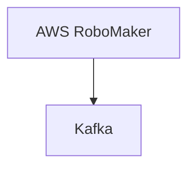

# Connect Kafka to AWS RoboMaker

Quix helps you integrate Kafka to AWS RoboMaker using pure Python.

<a class="md-button md-button--primary" href="https://share.hsforms.com/1iW0TmZzKQMChk0lxd_tGiw4yjw2?__hstc=175542013.2303933fbd746c0ac86d9ccbe9bc9100.1728383268831.1729603416735.1729620918855.31&__hssc=175542013.1.1729620918855&__hsfp=2132701734" target="_blank" style="margin-right:.5rem;">Book a demo</a>
 

## AWS RoboMaker

AWS RoboMaker is a cloud-based service provided by Amazon Web Services that enables developers to easily build, test, and deploy robotics applications. This comprehensive platform offers a wide range of tools and capabilities to accelerate the development process, including simulation environments, deep learning frameworks, and integration with popular robotics frameworks. By leveraging AWS RoboMaker, developers can quickly prototype and iterate on their robotic solutions, making it easier to bring their ideas to market faster and more cost-effectively. The service also includes seamless integration with other AWS services, allowing for easy scaling and management of robotic fleets.

## Integrations

Quix is a good fit for integrating with AWS RoboMaker because it offers a comprehensive platform for developing, deploying, and managing real-time data pipelines. With features like streamlined development and deployment, enhanced collaboration, real-time monitoring, and flexible scaling and management, Quix provides a robust environment for processing data efficiently and effectively.

Moreover, Quix Streams, a cloud-native library for processing data in Kafka using Python, aligns well with AWS RoboMaker's capabilities. With features like Python ecosystem integration, serialization and state management, time window aggregations, resilient scaling, and local and Jupyter notebook support, Quix Streams complements the functionalities of AWS RoboMaker and enhances the overall data processing workflow.

By leveraging Quix's comprehensive platform and Quix Streams library, developers can effectively build and deploy data pipelines on AWS RoboMaker, taking advantage of the scalability, flexibility, and efficiency offered by both technologies. The seamless integration of Quix with AWS RoboMaker can streamline the development and deployment process, improve collaboration, enable real-time monitoring, and enhance scalability, making it a powerful combination for handling complex data processing tasks.

