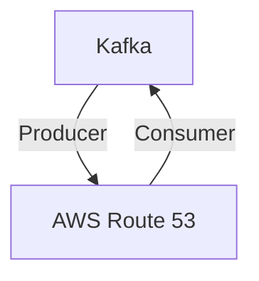

# Connect Kafka to AWS Route 53

Quix helps you integrate Kafka to AWS Route 53 using pure Python.

- __Find out how we can help you integrate!__

    <a class="md-button md-button--primary" href="https://share.hsforms.com/1iW0TmZzKQMChk0lxd_tGiw4yjw2?__hstc=175542013.2303933fbd746c0ac86d9ccbe9bc9100.1728383268831.1729603416735.1729620918855.31&__hssc=175542013.1.1729620918855&__hsfp=2132701734" target="_blank" style="margin:.5rem;">Book a demo</a>

## AWS Route 53

AWS Route 53 is a highly scalable and reliable cloud Domain Name System (DNS) web service provided by Amazon Web Services. This technology allows users to route end users to internet applications by translating human-readable domain names into numeric IP addresses. AWS Route 53 effectively manages traffic worldwide through a global network of DNS servers, providing low latency and high availability. It also offers advanced features such as health checks, failover routing, and geo-routing, making it an ideal choice for companies seeking a fast and secure global domain name system solution. With AWS Route 53, users can easily manage their domain names and ensure seamless performance for their web applications.

## Integrations

Quix is a good fit for integrating with AWS Route 53 because of its focus on real-time data pipelines and scalability. With features like streamlined development and deployment, enhanced collaboration, real-time monitoring, and flexible scaling and management, Quix is well-equipped to seamlessly integrate with AWS Route 53 for efficient DNS management and routing.

Quix's robust CI/CD processes and support for various data sources and sinks make it easy to integrate with AWS Route 53 for managing domain names and routing traffic to different services based on endpoint health and performance metrics. Additionally, Quix's security and compliance features ensure that sensitive information like secrets and credentials are securely managed in conjunction with AWS Route 53.

Furthermore, Quix Streams' cloud-native architecture and Python interface align well with AWS Route 53's scalable infrastructure and support for container orchestration. With Quix Streams' support for various serialization formats, stateful operations, and time window aggregations, it can effectively process and route data within the AWS Route 53 environment.

Overall, Quix's comprehensive platform and support for real-time data processing make it a natural fit for integrating with AWS Route 53 to streamline DNS management and routing processes for modern applications and services.

