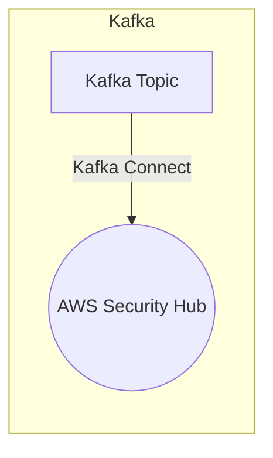

# Connect Kafka to AWS Security Hub

Quix helps you integrate Kafka to AWS Security Hub using pure Python.

- __Find out how we can help you integrate!__

    <a class="md-button md-button--primary" href="https://share.hsforms.com/1iW0TmZzKQMChk0lxd_tGiw4yjw2?__hstc=175542013.2303933fbd746c0ac86d9ccbe9bc9100.1728383268831.1729603416735.1729620918855.31&__hssc=175542013.1.1729620918855&__hsfp=2132701734" target="_blank" style="margin:.5rem;">Book a demo</a>

## AWS Security Hub

AWS Security Hub is a comprehensive security service by Amazon Web Services that provides a centralized place to manage security alerts and compliance status across an organization's AWS accounts. It continuously monitors and analyzes the security of AWS resources, such as EC2 instances, S3 buckets, and IAM roles, and consolidates findings from AWS GuardDuty, Inspector, and Macie, as well as third-party security tools. Security Hub offers automated security checks, prioritized security findings, and integrated workflows to help security teams quickly identify and remediate potential threats. With Security Hub, organizations can improve their security posture, streamline compliance audits, and gain better visibility into their overall security environment.

## Integrations

Quix is a good fit for integrating with AWS Security Hub because it provides a comprehensive platform for developing, deploying, and managing real-time data pipelines with a strong focus on security and compliance.

1. Security and Compliance: Quix ensures secure management of secrets and compliance with dedicated infrastructure options and SLAs, making it a reliable choice for integrating with AWS Security Hub, which is focused on continuous security monitoring and compliance.

2. Streamlined Development and Deployment: Quix offers integrated online code editors and CI/CD tools that simplify the creation and deployment of data pipelines, making it easy to integrate with AWS Security Hub for seamless deployment and monitoring of security-related pipelines.

3. Real-Time Monitoring: Quix Cloud provides tools for real-time logs, metrics, and data exploration, allowing users to monitor pipeline performance and critical metrics, which is essential for integrating with AWS Security Hub to ensure real-time monitoring of security events.

4. Flexible Scaling and Management: Quix allows users to easily scale resources, manage CPU and memory, and handle multiple environments linked to Git branches, providing the flexibility needed to integrate with AWS Security Hub and scale security monitoring capabilities as needed.

5. Development Tools: With online code editors, code templates, and connectors for various data sources and sinks, Quix facilitates efficient development and deployment of security-related pipelines, making it a good fit for integrating with AWS Security Hub for enhanced security monitoring.

In addition, Quix Streams, a cloud-native library for processing data in Kafka using Python, can help enhance the capabilities of AWS Security Hub by providing support for serialization, state management, time window aggregations, and resilient scaling, making it an ideal choice for processing security-related data and events within the AWS Security Hub framework.

